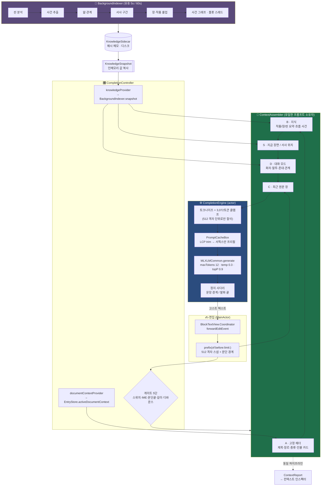
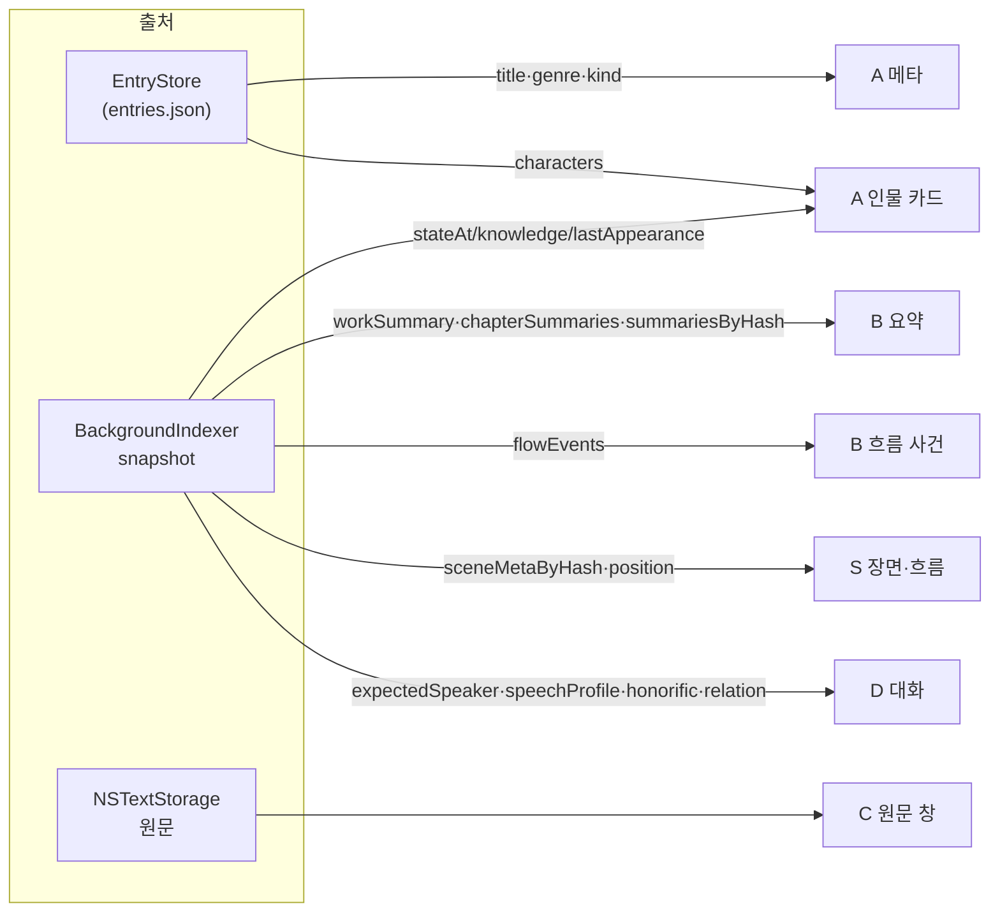
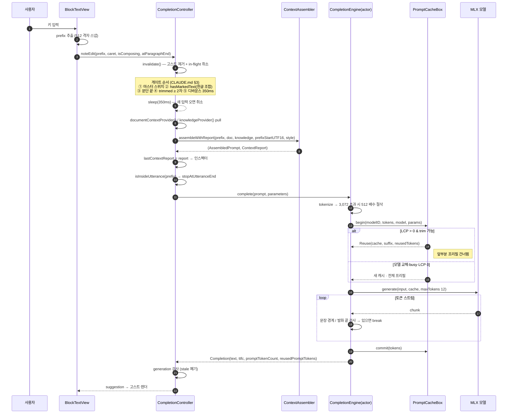
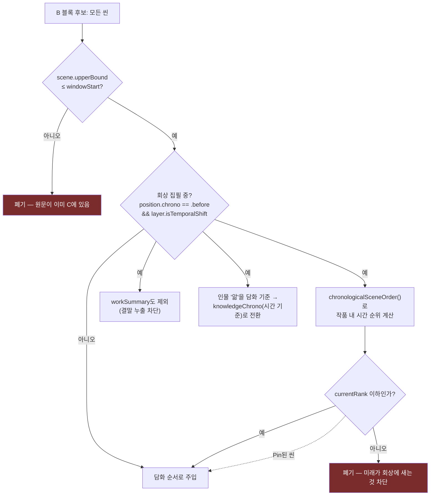
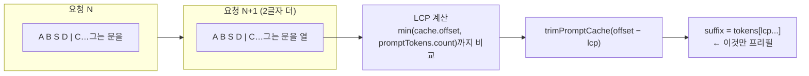
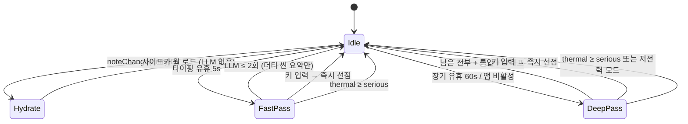
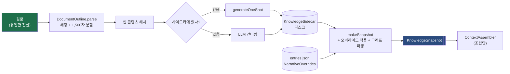
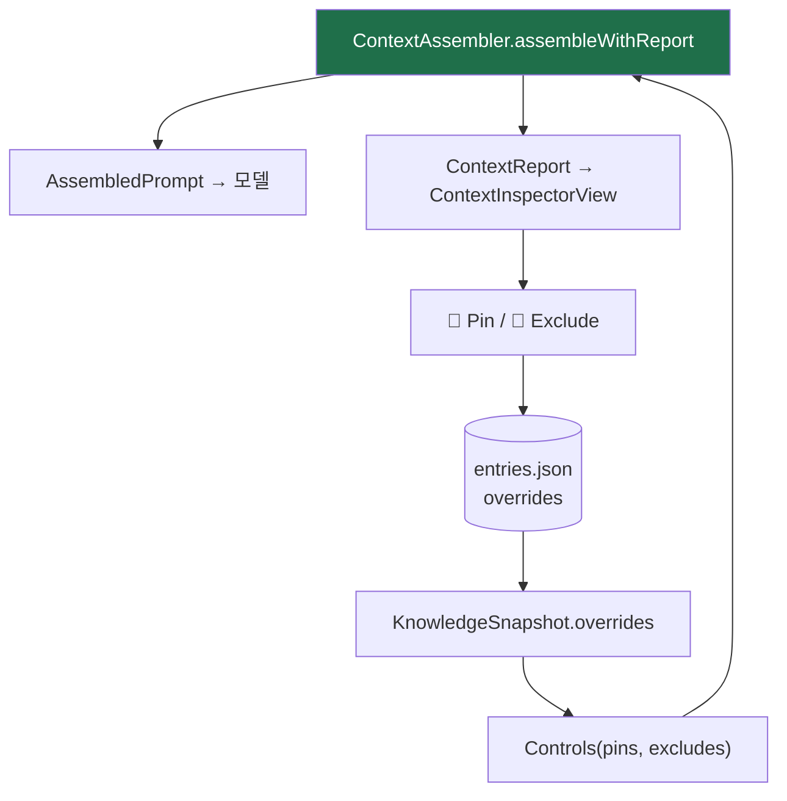
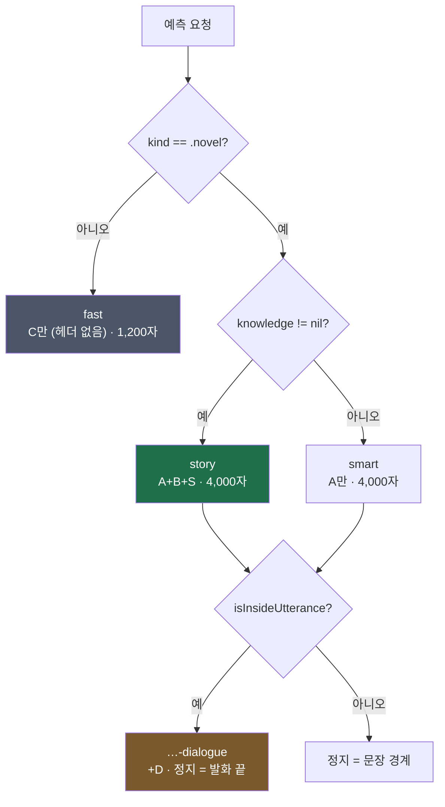

# CONTEXT_EXPLAIN — 로컬 LLM에 컨텍스트를 먹이는 방식

> 현재 코드(`main` + `claude/mint-competitor-research-agent-redesign-4ei0ej`) 기준
> 실제 구현 분석. 설계 의도는 [PLAN.md](PLAN.md), 불변 규칙은 [CLAUDE.md](CLAUDE.md).

MINT가 온디바이스 LLM에 무엇을, 언제, 어떤 순서로 넣는지에 대한 전수 조사다.
핵심 구조는 **두 개의 완전히 분리된 프롬프트 경로**다.

| | **예측 경로** (전경) | **이해 경로** (배경) |
|---|---|---|
| 진입점 | `CompletionController.runCompletion` | `BackgroundIndexer.runPass` |
| 프롬프트 소유자 | `ContextAssembler` | `BackgroundIndexer.Prompts` |
| 스타일 | `continuation` (기본) | 항상 `instruct` 챗 |
| LLM 호출 수 | **정확히 1회** | 씬 수 × 4 + 롤업 + 그래프 |
| 예산 | 헤더 700자 + 창 4,000자 / 3,072토큰 | 씬당 1,500 UTF-16 |
| 취소 | 다음 키 입력이 즉시 선점 | 키 입력이 언제나 이긴다 |
| KV 캐시 | 재사용 **함** (LCP) | 절대 손대지 않음 |

---

## 1. 전체 지도



---

## 2. 예측 프롬프트의 해부 — `[A | B | S | D | C]`

`ContextAssembler.assembleWithReport()`가 만드는 최종 문자열의 물리적 배치다.
**순서가 곧 성능 설계**다: 안정적인 것이 앞, 매 키 입력마다 변하는 것이 뒤 —
그래야 직전 요청과의 공통 접두(LCP)가 살아남아 KV 프리필을 건너뛴다.

```
┌─────────────────────────────────────────── 헤더 (총 ≤ 700자) ────┐
│ A  제목: 은빛 계단 · 장르: 미스터리 · 종류: 소설                    │  거의 안 변함
│ A  등장인물 서윤(윤이): 27세 기자… · 상태@커서: 위치=병원 · 감정=불안 │  ↕ 카드 ≤ 3장
│      · 앎: 형의 죽음(의심) · 최근: 병원에서 진료기록을 발견했다        │
├──────────────────────────────────────────── B (≤ 600자) ────────┤
│ B  지난 줄거리: …                                                │  창 밖 씬만
│ B  1부 > 2장: …                        ← 이전 장은 장 해상도       │  커서에서 먼 것부터 버림
│ B  앞선 장면(진료기록): …              ← 같은 장은 씬 해상도       │
├──────────────────────────────────────────────────────────────────┤
│ S  지금 장면: 아내의 외출 (회상 장면) · 장소: 옥탑방                │  씬 넘을 때만 변함
│ S  지금 흐름: 남편의 과거 (회상 · 깊이 1) — 이 시점 이후의 일은…    │
│ D  지금 대화 중 — 다음 발화: 서윤 (민호에게 반말) · 말투 예: "…"    │  커서마다 변함
│ D  서윤→민호 관계: 형의 옛 동료                                    │
└──────────────────────────────────────────────────────────────────┘
                              ↓ "\n\n"
┌─────────────────── C · 최근 원문 창 (저널 1,200자 / 소설 4,000자) ──┐
│ …커서 앞 본문 그대로. 시작점은 512 격자에 내림 스냅 + 근처 문단 경계 │
└──────────────────────────────────────────────────────────────────┘
                              ↓
                        모델이 여기서부터 이어씀
```

### 예산 상수 (`ContextAssembler`)

| 상수 | 값 | 삭감 순서 |
|---|---:|---|
| `maxHeaderCharacters` | 700 | 줄 단위로 통째 폐기 (중간 절단 금지 — 리포트와 어긋나므로) |
| `maxCards` | 3 | 예산 초과 시 **삭감 1순위** |
| `maxCardNoteCharacters` | 140 | |
| `maxKnowledgeCharacters` | 600 | 커서에서 **먼 것부터** 버림 |
| `maxStateCharacters` / `maxRecentEventCharacters` | 100 / 80 | |
| `maxKnowledgeFactsPerCard` | 2 | |
| `contextCharacters` / `novelContextCharacters` | 1,200 / 4,000 | soft — 하드 상한은 엔진의 토큰 예산 |
| `maxPromptTokens` (엔진) | 3,072 | 하드 — 초과분을 512 배수로 절삭 |

### 블록별 출처



---

## 3. 예측 시퀀스 — 키 입력 한 번의 전 생애



### 시점 차단 (time gating) — 스포일러 방지의 실체

커서 **이후**의 지식은 절대 들어가지 않는다. 세 겹으로 걸린다.



즉 **3장을 고치는 중에 9장의 결말이 새지 않고**, 나아가 회상을 쓰는 중이면
축이 담화 위치에서 *작품 내 시간*으로 바뀐다 — 그 시점의 인물이 모르는 것은
카드의 `앎:` 줄에도 나타나지 않는다. 유일한 예외는 사용자가 명시적으로 Pin한 항목.

---

## 4. KV 프리필 재사용 — "왜 순서가 그 순서인가"

지연의 대부분은 생성이 아니라 **프리필**이다. `PromptCacheBox`(`Inference/PromptCache.swift`)가
직전 프롬프트와의 최장 공통 접두만 남기고 새 토큰만 프리필한다.



이 구조가 조립기 전체의 배치를 규정한다:

- **C가 맨 뒤인 이유** — 매 키 입력마다 변하는 것이 앞에 있으면 뒤 전체가 무효화된다.
- **창 시작을 512 격자에 스냅하는 이유**(`BlockTextView.prefix`) — 스냅이 없으면 창 시작이 한 글자씩 밀려 LCP가 매번 0이 된다.
- **토큰 절삭도 512 배수인 이유**(`CompletionEngine`) — 같은 논리.
- **상태 필드를 `CaseIterable` 순서로 고정 렌더하는 이유** — 같은 상태가 패스마다 다른 순서로 찍히면 접두가 식는다.
- **카드를 "언급 최신순"이 아니라 문서 순서로 되돌리는 이유**(`selectCards`) — 창이 밀릴 때마다 순서가 흔들리면 마찬가지.
- **대화 블록 D가 헤더 맨 뒤인 이유** — 커서마다 변하므로 앞에 두면 A+B까지 식힌다.
- **`instruct`는 KV 재사용 대상이 아니다** — 챗 템플릿이 본문 *뒤*에도 토큰을 붙여 LCP 이득이 작다.
- **컨텍스트가 바뀌면 접두가 달라져 자동 무효화** — 별도 무효화 코드가 없다.
- **배경 작업(`generateOneShot`·`generateFolderName`)은 캐시 불가침** — 예측의 프리픽스를 식히지 않는다.

---

## 5. 이해 경로 — 배경이 준비하고, 예측은 조립만 한다

예측 시점에는 LLM 호출·디스크 접근이 **한 번도** 없다. 모든 지식은
`BackgroundIndexer`가 유휴 시간에 미리 만들어 `KnowledgeSnapshot`(인메모리 값 복사)으로 발행한다.



### 깊은 패스의 단계와 프롬프트 예산

| # | 단계 | 시스템 프롬프트 | maxTokens | 메모 키 | 패스 |
|---|---|---|---:|---|---|
| ① | 씬 분석 (제목·요약·유형·시점·장소) | `sceneSystem` | 192 | 씬 콘텐츠 해시 | fast + deep |
| ② | 사건 추출 (요약·참여·중요도·상태·근거) | `eventSystem` | 384 | `events[hash]` | deep |
| ②b | 심화 추출 (앎·관계) | `insightSystem` | 384 | `insights[hash]` | deep |
| ②c | 서사 구간 (회상·꿈·구술 층) | `segmentSystem` | 384 | `segments[hash]` | deep |
| ③ | 장 → 작품 롤업 | `chapterSystem` / `workSystem` | 128 / 160 | 더티 경로만 | deep |
| ④ | 사건 그래프 (인과·동일·시간) | `eventGraphSystem` | 384 | 사건 키 결합 해시 | deep |
| ⑤b | 플롯 스레드 (v6) | `plotThreadSystem` | 384 | 사건 키 해시 + `"plot"` | deep |
| — | 대화 보완 | `conversationSystem` | 128 | 대화 해시 | deep |
| — | 인물 프로파일링 | 인라인 | 96 | 등록 직후 1회 | 이벤트 |

배경 프롬프트의 공통 규율:

- **JSON이 아니라 줄 형식** — `사건요약 | 참여: … | 중요도: 1~5 | 상태: … | 근거: "원문 인용"`.
  소형 모델의 JSON 실패율을 피하고 파서가 부분 성공을 살린다.
- **근거 인용 강제** — 모든 추출이 원문 30자 이내 인용을 요구한다. 인스펙터의 "원문 보기"가 이걸로 점프한다.
- **인물 목록 선주입** — 지어낸 인물은 파서(`EventParser.resolve`)가 버리지만, 목록을 미리 주면 애초에 덜 지어낸다.
- **LLM 앞에 결정적 게이트** — 서사 구간 분석은 `TemporalShiftDetector.hasCandidate()`가 표지를 못 찾으면 LLM을 아예 부르지 않고 "단일 현재 서사"로 메모한다.
- **`enable_thinking: false`** + `<think>…</think>` 스트립 — Qwen3 계열의 사고 출력 차단.
- **씬 단위 체크포인트** — `sidecar.save()` + `publish()`가 씬마다. 선점당해도 거기까지의 이해는 살아남는다.
- **씬 원문 상한 1,500 UTF-16** — 프리필은 취소 불가 구간이라, 이 길이가 "타이핑 재개 → 예측이 엔진을 기다리는" 최악 지연을 결정한다.
- **실패 격리** — 단계마다 메모 키가 다르다. 한쪽 실패가 다른 쪽을 지우지 않고 다음 패스가 재시도한다.

### 배경 → 예측 데이터 흐름



---

## 6. 사용자 통제 — 리포트·Pin·Exclude

`ContextReport`는 **별도 프리뷰가 아니다.** 조립기가 프롬프트에 줄을 넣는 바로
그 자리에서 리포트에도 넣으므로, 인스펙터가 보는 것과 모델이 받은 것이 구조적으로 같다.
예산에서 줄이 떨어지면 리포트 항목도 함께 떨어진다.



각 항목은 **안정 키**(`stableKey`)로 정체를 갖는다 — `meta`, `card|<uuid>`,
`state|<uuid>`, `knowledge|<uuid>`, `recent|<uuid>`, `work`, `chapter|<path>`,
`scene|<hash>`, `current`, `narrative`, `flow`, `dialogue`, `relation|<a>|<b>`.

- **Pin** — 관련성이 낮아져도 유지. 예산 초과 시 다른 줄이 먼저 잘린다. 회상 집필 중 시간 차단도 무시한다 (명시적 사용자 결정이므로).
- **Exclude** — `Controls.allows()`가 조립 자체에서 뺀다.
- 항목 종류 13가지: 문서 정보 · 인물 카드 · 인물 상태 · 인물 앎 · 최근 사건 · 지난 줄거리 · 장 요약 · 앞선 장면 · 지금 장면 · 서사 위치 · 흐름 사건 · 대화 모드 · 관계.

---

## 7. 모드와 정지 조건

문서 종류와 지식 유무가 자동으로 모드를 정한다 (`runCompletion`의 `mode` 계산).



정지 사다리는 `maxTokens`(12) 도달 **전에** 끊는 조기 종료다.

- 기본: `. ! ? … 。 ！ ？ \n` 중 첫 문자까지 잘라내고 스트림 종료.
- 대화 모드: `” " 」 』 \n` — 대사 중간의 마침표에서 끊지 않는다.
- 후처리: `<think>` 스트립(instruct) → 양끝 따옴표 제거 → 첫 줄바꿈까지만 → 끝쪽 공백 제거.
  **선행 공백은 보존한다** — continuation에서는 어절 경계 정보다.
- `isInsideUtterance`는 **마지막 문단만** 본다. 앞 문단의 짝 안 맞는 따옴표(오탈자)가 온 문서를 대화 모드로 만들면 안 되므로.

---

## 8. 실제 프롬프트 예시 (story-dialogue 모드)

```text
제목: 은빛 계단 · 장르: 미스터리 · 종류: 소설
등장인물 서윤(윤이): 27세 사회부 기자. 형의 죽음을 파헤치는 중. · 상태@커서: 위치=성모병원 · 감정=불안 · 목표=진료기록 확보 · 앎: 형의 사인이 조작됐다(의심); 민호가 그날 병원에 있었다(안다) · 최근: 병원 기록보관실에서 낯선 서명을 발견했다
등장인물 민호: 형의 옛 동료. 말수가 적다. · 상태@커서: 위치=성모병원 · 감정=경계
지난 줄거리: 서윤은 형의 갑작스러운 죽음이 사고로 처리된 것에 의문을 품고…
1부 > 2장: 서윤이 형의 유품에서 병원 출입증을 발견하고 성모병원을 찾아간다.
앞선 장면(기록보관실): 서윤이 진료기록 사본에서 담당의와 다른 서명을 확인한다.
지금 장면: 복도에서의 대면 · 장소: 성모병원 3층
지금 대화 중 — 다음 발화: 민호 (서윤에게 반말) · 민호 말투 예: "그런 거 아니야." "됐어, 그만해."
민호→서윤 관계: 형의 동생 · 경계 대상

민호는 복도 끝에서 걸음을 멈췄다. 형광등이 한 번 깜빡였다.
"오랜만이네요."
서윤이 먼저 말을 걸었다. 민호는 대답 대신 창밖으로 시선을 돌렸다.
"
```

→ 모델은 마지막 `"` 뒤부터 이어쓰고, 닫는 따옴표에서 멈춘다.

---

## 9. 관측 가능한 값

| 값 | 위치 | 용도 |
|---|---|---|
| `promptTokenCount` | `Completion` | 클램프 후 실제 프롬프트 크기 |
| `reusedPromptTokens` | `Completion` | KV 재사용으로 건너뛴 프리필 토큰 |
| `timeToFirstChunk` / `totalTime` | `Completion` | 첫 고스트까지의 지연 |
| `promptTokensPerSecond` / `generationTokensPerSecond` | `Completion` | 프리필/디코드 처리량 |
| `stoppedAtSentenceBoundary` | `Completion` | 조기 종료 여부 |
| `lastContextReport` | `CompletionController` | 인스펙터 — 실제 주입 내역 |
| `KeystrokeStats` (handler/total p95) | `CompletionController` | 랙의 소재 분리 (우리 코드 vs 렌더) |
| `KnowledgeMetrics` (sidecarBytes/deriveMs/…) | `BackgroundIndexer` | 사이드카 → SQLite 이관 판단 근거 |
| `AcceptanceMetrics` (shown/acceptedFull/acceptedWord/dismissed × mode) | `Editor/` | 모드별 수락률 |

전부 **로컬 전용**이다. 원격 전송 경로는 코드에 존재하지 않는다.

---

## 10. 검토 — 잘된 것과 눈에 걸리는 것

### 설계적으로 강한 지점

1. **프롬프트의 단일 소유자.** `ContextAssembler`만 프롬프트를 만든다. 엔진은 조립에 관여하지 않고, 컨트롤러는 pull만 한다. 프롬프트가 어디서 왔는지 추적할 곳이 한 군데다.
2. **리포트 = 주입의 거울.** UI 전용 프리뷰 데이터가 없다는 것이 구조적으로 강제돼 있다 — 조립과 리포트가 같은 루프에 있으므로 어긋날 수 없다.
3. **KV 재사용이 배치·스냅·정렬까지 일관되게 규정.** 512 격자·`CaseIterable` 고정 순서·문서 순서 복원이 전부 같은 이유에서 나온다. 우연히 맞은 게 아니라 설계된 것.
4. **시점 차단의 3중 방어.** 창 밖 필터 → 시간 순서 필터 → `knowledgeChrono` 전환. 소설 도메인에 특화된, 범용 RAG가 못 하는 종류의 정확성이다.
5. **결정적 로직이 LLM 앞에 선다.** `TemporalShiftDetector` 게이트, `DialogueAttribution`, `ConversationDetector` — 토큰을 안 써도 되는 곳에서 안 쓴다.

### 걸리는 지점 (근거와 함께)

1. **`selectCards`의 언급 판정이 순진하다.** `window.contains(card.name)` 단순 부분 문자열 검색이라 "민호"가 "민호수"에 걸린다. 한국어 조사 처리를 하는 `CharacterLexicon`이 이미 있는데 여기서는 안 쓴다 (`ContextAssembler.swift:645`).
2. **카드 선택에 랭킹이 없다.** 언급된 카드가 3장을 넘으면 문서 순서 앞쪽이 이긴다 — 지금 장면의 주인공이 카드 목록 뒤에 있으면 밀린다. 코드 주석도 "세대 단위 랭킹은 M6"이라 미완을 인정하고 있다.
3. **스냅샷과 본문의 시차.** `KnowledgeSnapshot.outline`은 발행 시점의 좌표다. 타이핑으로 어긋나면 씬 위치 비교가 흔들린다. 주석은 "B는 창 밖 씬만 쓰므로 영향이 작다"고 하지만, 커서 근처에서 큰 편집(문단 삭제·붙여넣기)이 나면 `sceneIndex(at:)`가 틀린 씬을 가리킬 수 있고, 이는 **`S` 블록("지금 장면")이 틀리는 것**이라 영향이 작지 않다. 유휴 5초 안에 잡히긴 한다.
4. **`maxHeaderCharacters`(700)가 B(600)와 별도 예산이 아니다.** `knowledgeText`가 자체 600자 예산으로 만든 블록이 헤더에 `+`로 붙는데, 그 합에 대한 상한은 없다 — A 700 + B 600 = 최대 1,300자가 나갈 수 있다. `assembleWithReport`가 헤더 예산을 A에만 적용하기 때문. 의도된 것일 수 있으나 상수 이름이 그렇게 읽히지 않는다.
5. **`ContextAssembler`의 헬퍼 오버로드 중복.** `knowledgeText`·`dialogueText`·`headerText`가 각각 report 없는 버전을 갖고 있는데 테스트/구 호출부용으로 보인다. 리포트가 "주입의 거울"이라는 불변식을 지키려면 report 없는 경로가 존재하지 않는 편이 안전하다.
6. **측정 없는 상수들.** 700·600·140·100·80·3·2 — 전부 "PLAN §11 초기값, 벤치로 조정"이라고 주석돼 있고 아직 조정된 흔적이 없다. CLAUDE.md §2-7(측정 없이 튜닝 없음)의 반대편 — 측정 없이 정해진 값이 그대로 남아 있다. MINTBench에 헤더 예산 축이 있는지 확인이 필요하다.

---

## 부록 · 파일 색인

| 관심사 | 파일 |
|---|---|
| 프롬프트 조립 · 예산 · 시점 차단 · 리포트 | `Sources/MINTCore/Inference/ContextAssembler.swift` |
| 토크나이즈 · 생성 · 정지 사다리 · 후처리 | `Sources/MINTCore/Inference/CompletionEngine.swift` |
| KV 프리필 재사용 (LCP trim) | `Sources/MINTCore/Inference/PromptCache.swift` |
| 게이트 · 디바운스 · 모드 판정 · 인스펙터 발행 | `Sources/MINTCore/Editor/CompletionController.swift` |
| C 창 추출 (512 격자 스냅) | `Sources/MINTCore/Editor/BlockTextView.swift:360` |
| 배경 이해 파이프라인 · 배경 프롬프트 전문 | `Sources/MINTCore/Knowledge/BackgroundIndexer.swift` (`Prompts`는 :1199) |
| 스냅샷 스키마 · 질의(`stateAt`·`knowledge`·`position`·`expectedSpeaker`) | `Sources/MINTCore/Knowledge/KnowledgeStore.swift` |
| 씬 분할 (1,500 UTF-16) · 콘텐츠 해시 | `Sources/MINTCore/Knowledge/DocumentOutline.swift` |
| 예산·모델·창 크기 설정 | `Sources/MINTCore/Settings.swift` |
| 배선 (provider 3종) | `Sources/MINTCore/ContentView.swift:36–79` |
