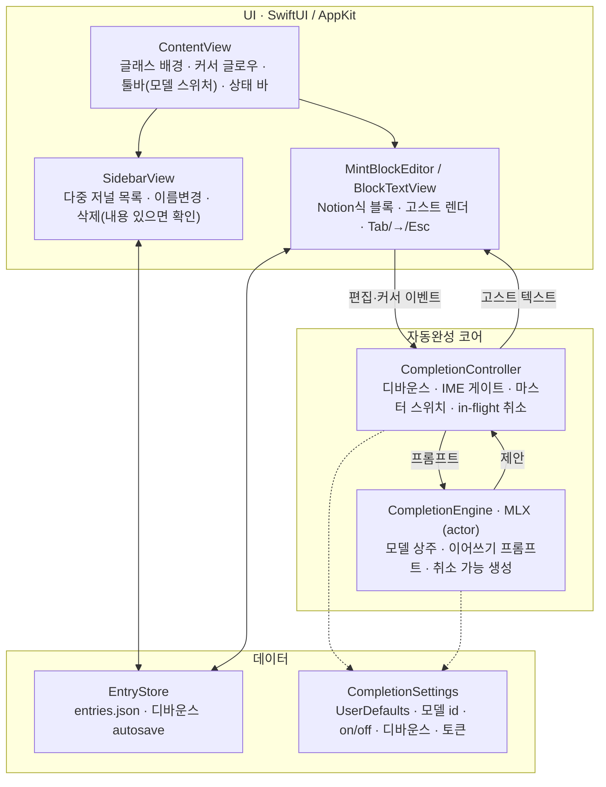

# MINT — 구현 계획 (Mac INtelligent note Taker)

> 한글 글쓰기를 위한 **온디바이스 스마트 자동완성 에디터**.
> IDE의 빠른 인라인 자동완성(Copilot식 고스트 텍스트)을 일상 저널링에 가져온다.
> 모든 추론은 **완전 로컬(MLX)** — 일기는 민감하니까, 프라이버시가 핵심 셀링포인트.

---

## 1. 제품 결정 (확정)

| 항목 | 결정 |
|------|------|
| 형태 | 독립형 macOS 네이티브 앱 (SwiftUI + 필요한 곳에 AppKit) |
| 핵심 UX | 인라인 고스트 텍스트, 타이핑 멈추면 자동 트리거, `Tab` 수락 / `→` 한 단어 / `Esc` 거부 |
| 제안 단위 | **단어/구 단위** (문단 아님 → 저지연·저위험) |
| AI | **완전 로컬** 추론 (MLX), **한국어 중심** 소형 모델, 켜고 끌 수 있음 |
| 컨텍스트 | **현재 문서만** 참고 (단순·빠름·완전 프라이버시) |
| 저장 | 로컬 JSON (`~/Documents/MINT/entries.json`) — 다중 저널 |
| UI | 에디터 v3 — 리퀴드 글래스, Notion식 블록 에디터, 사이드바(다중 저널), 커서 글로우 |

## 2. 제약 / 전제

- **Apple Silicon(M 시리즈) 필수** — MLX는 Apple Silicon GPU 기반.
- **한글 IME 조합 처리 필수** — 조합 중(예: ㅎ→하→한)에는 자동완성을 트리거하지 않는다.
- **지연시간 목표**: 첫 제안까지 **< ~300–500ms**.
- **빌드는 `xcodebuild` 경유 필수** — SwiftPM CLI는 MLX Metal 셰이더(metallib)를 못 만든다.
  `scripts/prepare-metallib.sh` 1회 실행 후 `swift run MINT` 가능. 상세는 [CLAUDE.md](CLAUDE.md).

## 3. 기술 스택

- **Swift 6 / SwiftUI** 앱 셸 + **AppKit `NSTextView`** (고스트 텍스트·블록 에디터는
  커스텀 NSTextView 필요).
- **MLX**: [`mlx-swift-lm`](https://github.com/ml-explore/mlx-swift-lm) (`MLXLLM`,
  `MLXLMCommon`, `MLXHuggingFace`) + `swift-huggingface`(HubClient) +
  `swift-transformers`(Tokenizers).
- **모델 프리셋** (UI 이름 nano/air/pro): `Qwen2.5-1.5B-4bit`(~1GB) /
  `Qwen2.5-3B-4bit`(~1.9GB) / `Qwen3.6-35B-A3B-4bit`(~20GB, 기본).
- **SwiftMath**: 수식 블록의 LaTeX 네이티브 렌더링 (CoreText 기반, iosMath 포트).

## 4. 아키텍처

**자동완성 게이트 순서** (`CompletionController.noteEdit`):
마스터 스위치 on → IME 조합 아님 → 커서가 문단 끝 → 컨텍스트 2자 이상
→ 디바운스 후 생성. 새 입력·커서 이동·Esc는 즉시 폐기 + in-flight 취소.

## 5. 마일스톤 / 현재 상태

| 단계 | 내용 | 상태 |
|------|------|------|
| M0–M1 | 스캐폴드 · 에디터 · 로컬 저장 | ✅ 완료 |
| M2 | 추론 선검증 (`MINTBench` CLI) | 🧪 코드 완료 — 모델별 측정으로 기본 모델 확정 남음 |
| M3 | 고스트 텍스트 자동완성 | ✅ 완료 (E2E는 실사용으로 검증 중) |
| v3 | 블록 에디터 · 리퀴드 글래스 · 다중 저널 · 모델 스위처 | ✅ 완료 |
| M4 | 다듬기 | 🔨 진행 중 |

**M4 남은 것**
- [ ] M2 측정 결과 반영 — 기본 모델·디바운스·토큰 상한 튜닝
- [ ] KV/프롬프트 캐시 재사용 (지연 최적화)
- [ ] 스타일링 디테일 (글래스 톤 통일 등) — 계속

## 6. 핵심 파일

| 파일 | 역할 |
|------|------|
| `Sources/MINT/MINTApp.swift` | `@main` 앱 + Settings 씬(⌘,) |
| `Sources/MINTCore/ContentView.swift` | 메인 화면 · 툴바 · 모델 스위처 · 상태 바 · `GlassSwitch` |
| `Sources/MINTCore/SidebarView.swift` | 저널 목록 (이름변경 · 삭제 확인) |
| `Sources/MINTCore/Editor/BlockTextView.swift` | 블록 에디터 + 고스트 렌더 + Tab/→/Esc |
| `Sources/MINTCore/Editor/CompletionController.swift` | 디바운스 · 게이트 · 수락/거부 · 취소 |
| `Sources/MINTCore/Inference/CompletionEngine.swift` | MLX 로드 + 취소 가능 생성 (actor) |
| `Sources/MINTCore/Storage/EntryStore.swift` | 다중 저널 JSON 저장 (디바운스 autosave) |
| `Sources/MINTCore/Settings.swift` | `CompletionSettings` · 모델 프리셋 |
| `Sources/MINTCore/Theme.swift` | 색·폰트 토큰 (라이트/다크) |
| `Sources/MINTBench/main.swift` | 추론 벤치 CLI |

## 7. 핵심 기술 리스크 & 대응

1. **한글 IME + 고스트**: `hasMarkedText()` 게이트 — 조합 커밋 + 멈춤일 때만 트리거.
2. **지연시간**: 4-bit 소형 모델 · 토큰 상한(~8–16) · 모델 상주 · 입력 시 in-flight 취소.
   KV 캐시 재사용은 M4.
3. **프롬프트 방식**: 이어쓰기(continuation, 기본) vs instruct — `MINTBench`로 측정해 확정.

## 8. 검증

- 컴파일 확인은 `swift build`, 실행은 metallib 준비 후 `swift run MINT` (CLAUDE.md).
- **E2E**: 한국어 입력 후 멈춤 → 회색 제안 ~500ms 내, **조합 중엔 미등장**; Tab 삽입 /
  → 한 단어 / Esc 폐기 / 계속 입력 시 취소; 재실행 시 저널 보존.
- **벤치**: `swift run -c release MINTBench` — 모델·프롬프트별 지연/품질 기록은
  [docs/m2-inference.md](docs/m2-inference.md).

## 9. 향후 확장 여지 (MVP 밖, 메모)

- 과거 기록 RAG(개인 메모리) · 소설 모드(캐릭터·플롯·세계관 컨텍스트)
- 개인 문체 LoRA 적응 · iCloud 동기화 · 노트 검색
