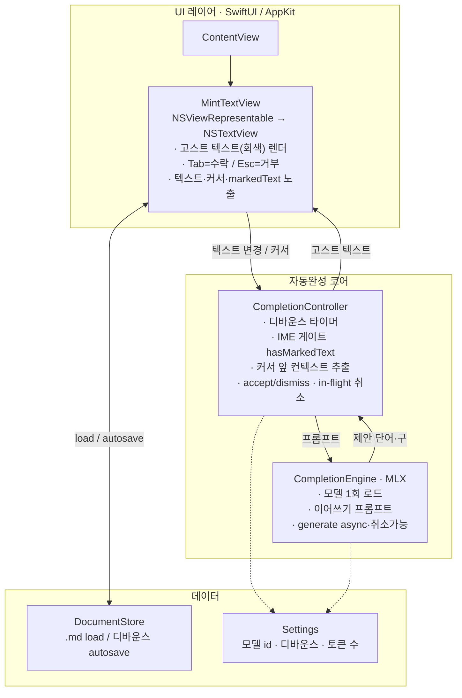
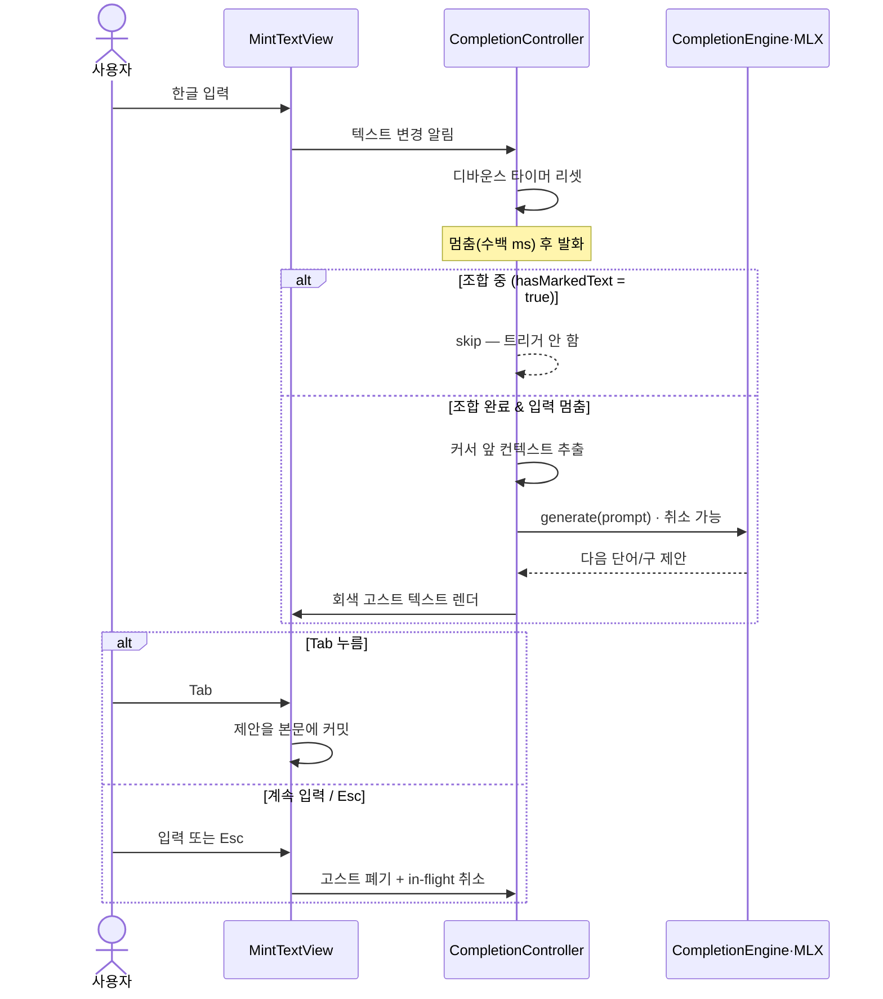
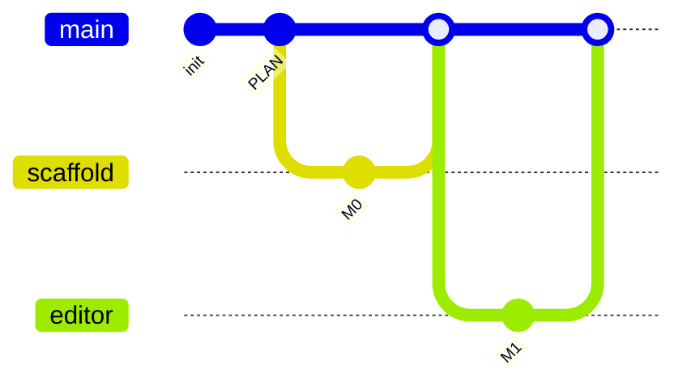

# MINT — 구현 계획 (Mac INtelligent note Taker)

> 한글 글쓰기를 위한 **온디바이스 스마트 자동완성 에디터**.
> IDE의 빠른 인라인 자동완성(Copilot식 고스트 텍스트)을 일상 저널링에 가져온다.
> 모든 추론은 **완전 로컬(MLX)** — 일기는 민감하니까, 프라이버시가 핵심 셀링포인트.

---

## 1. Context (왜 만드는가)

기존 글쓰기 툴(Notion 등)은 AI 보조는 주지만 **IDE식 빠른 인라인 자동완성**은 없다.
MINT는 그 빈틈을 메운다 — **Copilot 스타일 고스트 텍스트 자동완성**을 일상 저널링(그리고
이후 창작)에 가져오되, **완전 온디바이스(MLX)** 로 돌려 프라이버시와 속도를 동시에 잡는다.

### 확정된 제품 결정 (Q&A 결과)
| 항목 | 결정 |
|------|------|
| 형태 | 독립형 macOS 네이티브 앱 (SwiftUI + 필요한 곳에 AppKit) |
| 핵심 UX | 인라인 고스트 텍스트, 타이핑 멈추면 자동 트리거, `Tab` 수락 |
| 제안 단위 | **단어/구 단위** (문단 아님 → 저지연·저위험) |
| AI | **완전 로컬** 추론 (MLX), **한국어 중심** 소형 모델 |
| 컨텍스트 | **현재 문서만** 참고 (단순·빠름·완전 프라이버시) |
| 저장 | **로컬 마크다운(.md) 파일** |
| MVP 범위 | **초집중**: 자동완성 엔진 + 단일 에디터 (노트 관리/검색은 이후) |
| 목표 | **개인용 + 학습 프로젝트** (Apple Silicon, App Store 제약 미적용) |

## 2. 제약 / 전제
- **Apple Silicon(M 시리즈) 필수** — MLX는 Apple Silicon GPU 기반.
- **한글 IME 조합 처리 필수** — 조합 중(예: ㅎ→하→한)에는 자동완성을 트리거하지 않는다.
- **지연시간 목표**: 첫 제안까지 **< ~300–500ms**.

## 3. 기술 스택
- **Swift 6 / SwiftUI** 앱 셸 + **AppKit `NSTextView`** (고스트 텍스트는 SwiftUI
  `TextEditor`로는 커서/레이아웃 제어가 부족 → 커스텀 NSTextView 필요).
- **MLX**: Swift Package **[`mlx-swift-lm`](https://github.com/ml-explore/mlx-swift-lm)**
  의존 (주의: `MLXLLM`/`MLXLMCommon`이 `mlx-swift-examples`에서 `mlx-swift-lm`로 **이전됨**,
  최신 태그 3.31.3). 사용 라이브러리: `MLXLLM`, `MLXLMCommon`, `MLXHuggingFace`.
  3.x는 허브 다운로드가 매크로 통합으로 분리되어 **`swift-huggingface`(HubClient)와
  `swift-transformers`(Tokenizers) 의존이 추가로 필요**하다.
- **기본 모델**: `Qwen3.6-35B-A3B 4bit` (MoE·활성 ~3B → 한국어 품질↑, Apple Silicon 상주).
  실험 대안: `Qwen2.5-3B-Instruct-4bit`(더 가벼움), `Qwen2.5-1.5B-Instruct-4bit`(더 빠름).

---

## 4. 아키텍처 (컴포넌트)

## 5. 자동완성 데이터 흐름 (IME 게이트 포함)

---

## 6. 마일스톤

- **M0 — 스캐폴드** ✅: Xcode/SPM macOS 앱, `mlx-swift-lm` SPM 의존 추가, 빈 SwiftUI 창
  빌드·실행(Apple Silicon). `.gitignore`. README/PLAN 커밋. (`MINTCore`/`MINT` 2-타깃 분리)
- **M1 — 에디터 + 저장** ✅: `MintTextView` 기본 타이핑; `DocumentStore`로
  `~/Documents/MINT/journal.md`에 디바운스 autosave/load. 텍스트 왕복 검증.
- **M2 — 추론 리스크 선검증 (최우선 위험)** 🧪 *코드 완료 — Mac 측정 대기*:
  Qwen3.6-35B-A3B 4bit 로드, 하드코딩 한국어 이어쓰기 프롬프트 생성 → 출력·지연 로그.
  한국어 품질·속도 확인 후 기본 모델 확정. *가장 불확실한 가정을 가장 먼저 깬다.*
  → `CompletionEngine` + `MINTBench` CLI 구현, 측정 절차는 [docs/m2-inference.md](docs/m2-inference.md).
- **M3 — 고스트 텍스트 자동완성** 🔨 *코드 완료 — Mac E2E 검증 대기*:
  디바운스 + IME 게이트 + 컨텍스트 추출 + 취소 가능 생성 + 회색 고스트 렌더 +
  Tab 수락 / Esc 거부 / 입력 시 취소 통합. 검증 절차는 [docs/m3-ghost-text.md](docs/m3-ghost-text.md).
- **M4 — 다듬기** 🔨 *부분 구현*: Settings UI(모델·프롬프트 방식·디바운스·토큰·온도, ⌘,)와
  엔진 상태 바(다운로드 진행률·지연 표시)는 구현됨. 남은 것: M2 측정 반영 지연 튜닝,
  KV/프롬프트 캐시 재사용, 스타일링 다듬기.

## 7. 개발 워크플로우 (1인 트렁크 기반)

**관심사 분리는 브랜치가 아니라 디렉터리/모듈로**, **버전 관리 흐름은 트렁크 기반**으로 간다.
혼자 개발하므로 장기 병렬 브랜치는 통합 비용만 키운다 → `main`을 항상 빌드되는 단일
트렁크로 두고, 마일스톤마다 단기 브랜치를 만들어 머지 후 삭제한다.

- **`main`** = 항상 빌드되는 단일 트렁크. 여기서 분기하고 여기로 합친다.
- 마일스톤(세로 슬라이스) 하나당 **단기 브랜치 하나** → Mac에서 빌드 검증 후 main에 머지 → **삭제**.
- 관심사 분리는 `Sources/MINT/Editor · Inference · Storage` **폴더/모듈**로 한다 (브랜치 ❌).
- 장기 계층 브랜치(`frontend`/`backend`/`design`)는 **쓰지 않는다** — 단일 바이너리라
  한 기능이 여러 계층을 동시에 가로질러 통합 비용만 커진다.

**브랜치 명명 규칙**

| 접두사 | 용도 | 예 |
|--------|------|-----|
| `feat/` | 기능 마일스톤 | `feat/m0-scaffold`, `feat/m3-ghost-text` |
| `spike/` | 실험·리스크 선검증 | `spike/m2-inference` |
| `fix/` | 버그 수정 | `fix/ime-marked-text` |

## 8. 핵심 파일 (실제 경로 — `MINTCore` 라이브러리 + 얇은 실행 셸)
| 파일 | 역할 |
|------|------|
| `Package.swift` | SPM 설정 (mlx-swift-lm·swift-huggingface·swift-transformers 의존) |
| `Sources/MINT/MINTApp.swift` | `@main` SwiftUI 앱 + Settings 씬 |
| `Sources/MINTCore/ContentView.swift` | 에디터 화면 + 엔진 상태 바 |
| `Sources/MINTCore/Editor/MintTextView.swift` | NSViewRepresentable + `GhostTextView`(고스트 렌더·Tab/Esc) |
| `Sources/MINTCore/Editor/CompletionController.swift` | 디바운스·IME 게이트·accept/dismiss·취소 |
| `Sources/MINTCore/Inference/CompletionEngine.swift` | MLX 로드 + 취소 가능 생성 + 프롬프트 (actor) |
| `Sources/MINTCore/Storage/DocumentStore.swift` | `.md` load/save (디바운스 autosave) |
| `Sources/MINTCore/Settings.swift` | 설정 모델 (`CompletionSettings`/`CompletionParameters`/프리셋) |
| `Sources/MINTCore/SettingsView.swift` | 설정 화면 (M4) |
| `Sources/MINTBench/main.swift` | M2 추론 선검증 CLI |

## 9. 핵심 기술 리스크 & 대응
1. **한글 IME + 고스트 텍스트**: `hasMarkedText()`로 게이트, 조합 커밋 + 멈춤일 때만
   트리거. 고스트는 커밋 안 된 임시 회색 attributed 텍스트로 렌더, Tab 전엔 본문 미반영.
2. **지연시간**: 4-bit 소형 모델, 토큰 상한(~8–16), sentence boundary에서 stop, 모델
   상주, 새 키 입력 시 in-flight 취소. (KV 캐시 재사용은 이후 최적화.)
3. **NSTextView 고스트 렌더**: TextKit 활용. 제안을 비영속 스타일 substring으로 삽입하거나
   layout manager로 그림. 커서는 항상 고스트 앞, 편집 시 즉시 제거.
4. **이어쓰기 vs instruct 프롬프트**: instruct 모델 + 간결 시스템 프롬프트("이어질 내용을
   자연스럽게 짧게 이어써") vs 순수 continuation — M2/M3에서 실험해 결정.

## 10. 검증 (Verification)
- **빌드·실행**: Apple Silicon Mac에서 Xcode 빌드/실행.
- **M2**: 콘솔에 한국어 이어쓰기 출력 + 지연시간이 목표 이내인지 확인. 모델 크기별 비교.
- **M3 End-to-End**: 한국어 입력 후 멈춤 → 회색 제안 ~500ms 내 등장, **조합 중엔 미등장**;
  Tab → 삽입; Esc → 폐기; 계속 입력 → in-flight 취소; 종료/재실행 → `.md` 보존.

## 11. 향후 확장 여지 (현재 MVP 결정 밖, 메모)
- 과거 기록 RAG(개인 메모리) · 소설 모드(캐릭터·플롯·세계관 컨텍스트)
- 개인 문체 LoRA 적응 · iCloud 동기화 · 노트 관리/검색 UI

---
> ⚠️ **개발 환경 참고**: 현재 원격 실행 환경(Linux)에서는 macOS SwiftUI + MLX 앱을
> 빌드/실행할 수 없다. 코드는 여기서 작성·커밋하고, **컴파일·실행·검증은 Apple Silicon
> Mac의 Xcode에서** 수행한다.
