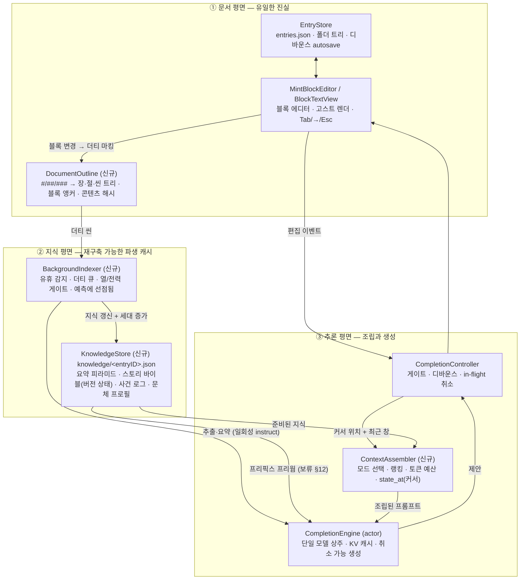

# MINT — 예측 글쓰기 엔진 아키텍처 & 구현 계획

> 한글 **장편 소설**을 위한 온디바이스 예측 글쓰기 엔진 (macOS 네이티브).
> 철학·불변 규칙은 [CLAUDE.md](CLAUDE.md) — 이 문서는 그것을 구현하는
> 시스템 설계와 로드맵이다. 살아있는 문서: 설계가 바뀌면 같은 커밋에서 갱신한다.
>
> **"백그라운드가 이해를 준비하고, 예측은 조립만 한다."**

---

## 1. 비전 — 그리고 통념에 대한 비판

MINT의 목표는 자동완성이 아니라 **기억하는 공저자**다. 사용자가 느껴야 하는 것:

- AI가 최근 문단을 "읽는" 게 아니라 이야기를 **기억한다**.
- 제안이 인물의 성격·말투·관계·시간선·세계 상태·과거 사건을 보존한다.
- 앱을 켜 둔 것만으로 AI의 이해가 원고와 함께 자란다.

이를 위해 흔한 AI 에디터 아키텍처를 그대로 베끼지 않는다. 온디바이스(MLX,
소형 모델) + 소설 도메인이라는 조건에서 통념을 검토한 결과:

| 통념 | 온디바이스·소설에서의 문제 | MINT의 선택 |
|------|------|------|
| **거대 컨텍스트 창** (원고를 통째로 프롬프트에) | 프리필 지연이 선형 증가 — 키 입력마다 수만 토큰 재계산은 배터리·열·지연 모두 실격. 소형 모델은 긴 컨텍스트 중간을 잘 잃는다 | **계층 요약 + 구조화 지식**을 수백 토큰으로 압축 주입. 원문은 최근 창만 |
| **범용 벡터 RAG** (청크 임베딩 → 코사인 검색) | 소설의 관련성은 어휘 유사도가 아니라 **인물·인과** 축으로 결정된다. 임베딩 모델 상주는 메모리 압박, 검색 결과(산문 청크)는 토큰 비효율 | **엔티티 앵커 검색**: "이 씬의 인물이 겪은 사건·상태"를 구조화 카드로 주입. 임베딩은 측정으로 이길 때만 추가 (§15) |
| **예측 시점 에이전트 체인** (계획→검색→생성 다중 호출) | 고스트 텍스트는 ~0.5초 승부 — 다중 왕복은 UX 사망 | 다단계 추론은 전부 **백그라운드**로. 예측은 단일 생성 호출 |
| **덮어쓰는 단일 요약** (rolling summary 하나) | 시간선이 뭉개진다. 3장을 고칠 때 9장 지식이 새어 들고, 과거 상태를 물을 수 없다 | **위치-버전 상태 델타** (append-only) — `state_at(커서)` 질의로 그 시점의 세계만 주입 |

또한 요구된 7계층 메모리(Session/Chapter/Character/Story/World/Timeline/Style)를
그대로 7개 저장소로 만들지 않는다 — 저장소마다 갱신 파이프라인·주입 정책·부패
지점이 생겨 온디바이스 예산을 넘는다. §6에서 **4개 구조 + 라이브 창**으로 축약하고,
7계층은 그 위의 **질의(view)**로 제공한다. 표현력은 같고 유지 비용은 절반이다.

## 2. 제품 결정 (확정)

| 항목 | 결정 |
|------|------|
| 형태 | 독립형 macOS 네이티브 앱 (SwiftUI + 필요한 곳에 AppKit), Apple Silicon 필수 |
| 핵심 UX | 인라인 고스트 텍스트. `Tab` 수락 / `→` 한 단어 / `Esc` 거부. 조용한 UI |
| 최우선 도메인 | **소설** (`EntryKind.novel`). 저널·일반 문서는 Fast 모드로 지원 |
| AI | **완전 로컬**(MLX) 한국어 중심 소형 모델. 마스터 스위치로 끌 수 있음 |
| 컨텍스트 | 최근 원문 창 + **백그라운드가 준비한 구조화 지식** (작품 메타·요약·인물 카드·사건) |
| 기억 | 원문에서 파생된 재구축 가능한 사이드카 (§6). 사용자가 열람·수정 가능 |
| 저장 | 로컬 JSON — 원문 `~/Documents/MINT/entries.json`, 지식 `knowledge/<entryID>.json` |
| 예측 모드 | **Fast / Smart / Story** (§10) — 종류·바이블 유무로 자동 선택 + 수동 오버라이드 |

## 3. 기술 스택 & 제약

- **Swift 6 / SwiftUI** 앱 셸 + **AppKit `NSTextView`** (고스트 텍스트·블록 에디터).
- **MLX**: `mlx-swift-lm` (`MLXLLM`, `MLXLMCommon`, `MLXHuggingFace`) +
  `swift-huggingface` + `swift-transformers`(Tokenizers). **SwiftMath** (수식 렌더).
- **모델 프리셋 — 라인업 v2** (2026-07-17): 체급 사다리(nano/air/pro)를 버리고
  **허브 이름 mint/basil/peppermint**로 간다. 근거: 셋 다 27~35B급 이해에 8.5–20GB로
  체급이 좁아졌고, 다른 것은 크기가 아니라 **성격**이다. 특히 MINT는 파일이 가장
  작은데 밀집 모델이라 디코딩이 가장 느릴 수 있어 "nano = 빠름"이 거짓 약속이 된다.
  | UI | 저장소 | 크기 | 성격 |
  |---|---|---|---|
  | **MINT** (기본) | `prism-ml/Ternary-Bonsai-27B-mlx-2bit` | ~8.5GB | Qwen3.5-27B **밀집**, 2비트 삼진(~1.71bpw). 토큰마다 전 가중치를 읽어 대역폭이 MoE보다 크다 |
  | **Basil** | `mlx-community/GLM-4.7-Flash-4bit` | ~16.9GB | MoE 총 30B·활성 ~3B (`glm4_moe_lite`, mlx-swift-lm 3.31.3+) |
  | **Peppermint** | `mlx-community/Qwen3.6-35B-A3B-4bit` | ~20GB | MoE 활성 ~3B |
  MINT의 config는 VLM(`Qwen3_5ForConditionalGeneration` + vision_config)이지만
  `model_type: "qwen3_5"`가 LLMModelFactory에 등록돼 있고 `Qwen35Model`이
  `textConfig`만 취해 로드한다 (비전 타워 미사용 — 다운로드엔 포함).
  ⚠️ **MINT의 한국어 품질·지연 미측정** — 모델 카드에 한국어 명시 없음 + 1.71bpw
  공격적 양자화. 실사용·벤치로 판정 (§16 열린 질문 1).
  경량 대안(`Qwen2.5-3B-4bit` ~1.9GB, `Qwen2.5-1.5B-4bit` ~1GB)은 피커에서
  빠졌고 Settings 직접 입력·벤치 `--model`로만 쓴다.
- **한글 IME 조합 처리 필수** — 조합 중 트리거 금지 (CLAUDE.md §3).
- **빌드는 `xcodebuild` 경유 필수** — metallib 제약, 상세는 CLAUDE.md §0.
- 백그라운드 추론도 같은 단일 모델·같은 `CompletionEngine` 컨테이너를 공유한다
  (이중 로드 금지 — `generateFolderName`이 선례).

## 4. 전체 아키텍처 — 세 평면



**세 경로의 데이터 흐름**

1. **쓰기 경로** (매 키 입력, 동기·초경량): 편집 → 블록 콘텐츠 해시 무효화 →
   소속 씬 더티 마킹. LLM·디스크 접근 없음.
2. **이해 경로** (유휴 시, 백그라운드): 유휴 감지 → 더티 씬 추출·요약 →
   KnowledgeStore 갱신(append) → 지식 세대 +1. (KV 프리웜은 보류 — §12.)
3. **예측 경로** (디바운스 후, ~0.5초 예산): 게이트 → 모드 선택 → 준비된 지식
   랭킹·조립 → 단일 생성 → 후처리 → 고스트. **여기서 지식을 만들지 않는다.**

## 5. 문서 모델

- **아웃라인 트리**: 마크다운 헤딩 `#`(부/장) `##`(장/절) `###`(씬)을 결정적으로
  파싱해 작품 구조로 쓴다 — 사용자의 장 구조가 곧 타임라인 골격이다 (§8).
  헤딩 없는 문서는 전체가 단일 씬 (저널이 자연히 이 경우). 단, **씬은 크기
  상한(1500)도 함께 지킨다** — 넘는 본문은 문장 경계·CDC로 세그먼트 분할
  (이해 범위 100%, docs/m6-scene-split.md). Pos 의미는 불변.
- **블록 앵커**: 블록별 안정 ID + 콘텐츠 해시. 더티 추적과 지식 앵커링의 단위.
  파생 지식은 항상 앵커를 물고 있어, 블록이 지워지면 그 지식도 무효화(톰스톤)된다.
- **위치 키** `Pos = (장 경로, 씬 순번, 블록 순번)` — 모든 지식 버전의 축.
  v1의 시간축은 담화 순서(문서 순서)다 — 플래시백 구분은 Advanced (§8).
- **작품 메타** (제목·장르·시점·문체 노트·로그라인): 사용자 저작 데이터이므로
  파생 캐시가 아니라 `JournalEntry`의 옵셔널 필드로 (레거시 호환 패턴은
  `titleIsCustom`이 선례). LLM은 초안만 제안, 확정은 사용자.
- **1작품 = 1문서** (현행 유지). "폴더 = 작품(장별 문서)"은 열린 질문 (§16).

## 6. 지식 저장소 — 계층 메모리의 실체

요구된 7계층 → **4구조 + 라이브 창**. 계층별 매핑:

| 요구 계층 | 실체 | 근거 |
|------|------|------|
| Session | 라이브 창 (커서 앞 최근 원문) | 저장 불필요 — 항상 문서에서 즉시 취득 |
| Chapter / Story | **6.1 요약 피라미드** | 같은 자료의 해상도 차이 — 한 구조의 두 층 |
| Character / World | **6.2 스토리 바이블** (타입 다른 엔티티) | 인물·장소·설정은 같은 "버전 상태" 메커니즘 |
| Timeline | 별도 저장소가 아니라 **모든 지식의 인덱스 축** (Pos 버전) | 따로 두면 이중 기록 — 시간은 차원이지 데이터가 아니다 |
| Style | **6.4 문체 프로필** | 작품 전역 + 인물별 말투 |

트레이드오프: 구조 수를 줄인 대신 질의 계층(`state_at`, `summary(level:upTo:)`)이
계층 개념을 복원해야 한다. 저장소 4개의 갱신 파이프라인만 관리하면 되므로
온디바이스 배터리·복잡도 예산에 맞다.

### 6.1 요약 피라미드 (증분)

- 씬 요약(1–2문장, ≤120자) → 장 요약(≤300자, 하위 씬 요약에서 생성) →
  작품 요약(≤500자, 장 요약에서 생성). **상향 전파는 더티 경로만**.
- 각 노드는 (앵커, 콘텐츠 해시, 요약, 갱신 시각)을 갖는다 — 해시가 같으면 재요약 금지.
- 프롬프트에는 "커서 위치 **이전까지의** 요약"만 조립한다 (§11).

### 6.2 스토리 바이블 — 엔티티 & 버전 상태

- 엔티티: `인물 | 장소 | 사물 | 설정` 타입. 공통 필드: 정식 이름, 별칭(호칭 포함),
  등록 출처(사용자 사전 정의 | 자동 감지 후 사용자 승인), 첫 등장 Pos.
- **상태는 덮어쓰지 않는다** — `StateDelta(pos, 필드, 값, 근거 앵커)`를 append.
  `state_at(pos)`는 pos 이하 델타를 접어서(fold) 그 시점 상태를 만든다.
  이것이 "시간 인지 메모리 > 정적 요약"의 구현이자, 문서 중간 편집 시
  미래 지식 누출을 막는 장치다.
- 사용자 편집은 `locked` 플래그가 붙어 자동 추출이 덮지 못한다 (CLAUDE.md §1-5).

### 6.3 사건 로그 (append-only)

```
Event { pos, 참여 엔티티 [ID], 요약(≤80자), 상태 효과 [StateDelta 참조], 중요도 1–5 }
```
- 인물별 역색인(참여 사건 목록)을 함께 유지 — §11 엔티티 앵커 검색의 기반.
- 앵커 블록이 지워지면 톰스톤 → 다음 이해 패스에서 재추출.

### 6.4 문체 프로필

- **작품 문체 카드**: 시점(1인칭 등)·시제·문장 길이 경향·서술 톤 (≤80자, LLM 생성 + 사용자 수정).
- **인물 말투**: 종결어미 버릇("~거든", "~습니다"), 반말/존댓말 기본값, 대표 대사
  예문 K개(최근 우선, 결정적 수집 — 대화 귀속 §7에서 나온 실제 문장).
- **관계쌍 존대 매트릭스**: (A→B) 방향별 반말/존댓말/혼재. 한국어 대화 예측의
  핵심 구조 — A가 B에게 반말, B가 A에게 존댓말인 비대칭은 관계에 새겨진 강한
  예측 신호인데, 범용 아키텍처엔 이 자리가 없다. MINT의 차별점.

### 6.5 Narrative Intelligence (v4) — 근거·앎·관계·브랜치

> 2026-07-19: **설정 충돌·복선 기능 제거** (사용자 지시). 고아가 된 설정 사실
> (`ContinuityFact`)도 함께 삭제 — 사이드카 schemaVersion 6→7. 아래에서 그 두
> 기능 항목은 삭제됐다.

씬 이해가 요약을 넘어 **검증·수정 가능한 세계 모델**이 되는 층. 원칙:
원문을 복제하지 않고 씬 해시 + 짧은 인용(quote)으로 참조하며, 인용은 씬 원문
대조로 검증된다 (환각 인용은 버리고 `추론` 근거로 강등 — `EvidenceKind`).

- **씬 메타**: 씬 분석이 요약과 함께 내용 기반 제목·서사 유형(현재/회상/꿈/예상/
  병렬/삽입)·시점 인물·장소를 뽑는다 (`SceneSummary` v4 확장).
- **심화 추출** (`SceneInsights`, 씬당 1회·깊은 패스): 앎 델타(인물×태도
  안다/의심/오해/숨김×사실), 방향 관계 델타(A→B=값).
  전부 append-only — `knowledge(of:before:)`·`relation(from:to:before:)`가
  시점 차단 fold로 그 시점 값을 만든다 (StateDelta와 같은 문법).
- **브랜치**: 연속된 비(非)현재 씬 묶음에서 **결정적으로 파생** (저장 안 함).
  한 문장 회상은 브랜치가 아니다 — 씬 전체가 회상일 때만. 시간 관계는 상대값
  (과거/미래/동시/불명)만 표현한다 — 절대 연표는 소설에서 대개 알 수 없다.
- **대화 인덱스**: 발화(§6.4)에서 결정적 파생 — 씬 경계·간격으로 묶고 원문
  위치만 참조한다 (대사 복제 금지).
- **사용자 수정** (`NarrativeOverride`): 파생 캐시가 아니라 **entries.json**에
  산다 — 사이드카 스키마 폐기·재분석이 사용자 결정을 못 건드리는 구조적 보장.
  씬 키 오버라이드는 원문 수정으로 해시가 바뀌면 앵커 스니펫으로 재키하고,
  실패분은 stale로 보존·표시한다 (조용한 삭제 금지).
- **컨텍스트 리포트** (`ContextReport`): 조립기가 프롬프트에 넣는 줄을 그
  자리에서 기록 — 인스펙터가 보는 것 = 모델이 받은 것 (별도 프리뷰 금지).

### 6.6 Narrative Graph (v5) — 구간·흐름·정본 사건·인과·시간 부분 순서

§6.5의 브랜치(선형 레일)를 **다층 서사 그래프**로 확장하는 층. 핵심 결정:
**사건이 중심이다** — 흐름(브랜치)이 사건을 소유하지 않고, 하나의 정본 사건을
여러 흐름이 참조한다. 분화·합류·교차는 별도 저장물이 아니라 "같은 정본 사건을
공유하는 흐름들"에서 결정적으로 파생된다.

- **NarrativeSegment** (씬 내부 구간, LLM 추출·사이드카 저장): 씬 하나 안의
  현재→회상→회상 속 회상→복귀를 구간 단위로 표현한다. 층(현재/회상/짧은기억/
  구술/꿈/기록/재서술/언급/예상/불확실)·깊이·부모/복귀 대상·POV·서술자·초점·
  소속 인물·출처(직접서술/기억/증언/기록물/소문/꿈속/추론)·신뢰(확정/유력/이견/
  불신/미상)·확신. **경계 인용은 씬 원문 대조로 검증** — 환각 경계는 구간째
  버리고, 복귀를 못 찾으면 uncertain을 유지한다 (임의 확정 금지).
  파이프라인: ① 결정적 표지 감지(`TemporalShiftDetector`)가 LLM 게이트 →
  ② 씬당 1회 structured 호출 → ③ `SegmentParser` 검증. 과거형 시제만으로는
  회상이 아니다.
- **정본 사건과 관점** (`EventIdentity`·`CanonicalEvent`·`EventPerspective`):
  같은 사건의 재서술(회상·증언)은 사건을 복제하지 않고 정본 키 하나에 관점으로
  붙는다. 관점끼리 내용이 갈리면 어느 쪽도 '확정'으로 승격하지 않는다 —
  독자·인물의 기억은 서로 모순될 수 있고, 진실 판정은 사용자 몫이다.
- **인과 그래프** (`CausalLink`): 원인/영향/폭로/설명/모순/복선 — 시간 순서와
  별도 축. 깊은 패스가 사건 목록 전체를 번호로 제시해 1회 호출로 후보를 받고
  (`EventGraphParser`, 사건 키 집합 해시로 메모), 사용자가 추가·삭제한다.
- **시간 부분 순서** (`ChronoEdge`·`ChronoOrder`): before/after/simultaneous/
  approximate/unknown 간선의 부분 순서를 위상 정렬로 해석한다. 정보가 부족하면
  담화 순서를 유지하고(임의 연표 금지), 모순(사이클) 간선은 Conflict로 표시한다.
  회상 브랜치 사건→다음 현재 사건의 before 간선은 층 정의에서 결정적으로 파생.
- **서사 흐름** (`NarrativeFlow`, 파생 — 저장 안 함): Main(독자가 따라가는
  중심 흐름 — 주인공 타임라인이 아니다)·인물 흐름(참여 정본 사건 2개↑)·시간
  흐름(§6.5 브랜치 승격). persistent ID(main 고정·인물 UUID·앵커 해시)에서
  색 시드가 나와 재분석 후에도 색·레인이 안정된다.
- **Reader/Character 지식 분리**: `readerKnowledge(before:)`(담화 기준 —
  회상으로 공개된 비밀은 독자가 안다)와 `knowledge(of:before:)`(인물별) +
  `knowledgeChrono(of:atSceneIndex:)`(작품 내 시간 기준 — 회상 집필 중 그
  시점의 인물이 모르는 미래 앎을 차단). 조립기는 커서의
  `position(at:)`(흐름·층·깊이·시간)으로 축을 고른다 (§11).
- **대화 기록** (`RecordedConversation`, entries.json): 작성 중 결정적
  감지(`ConversationDetector` — 실시간 경로 LLM 금지) → 「이 대화를
  기록할까요?」 인라인 제안 → Enter 기록(개행은 정상 진행). 기록은 자동 감지
  인덱스에 겹쳐 하나의 목록이 되고, 주제·어조 보완만 깊은 패스가 채운다
  (`ConversationMeta`, contentHash 메모).
- **Plot Thread** (`PlotThread`·`ResolvedPlotThread`, v6): Narrative Graph의
  **branch 단위 = 플롯 라인** (인물·POV·씬·회상이 아니다). 하나의 지속적인
  문제·목표·갈등을 추적하는 사건 묶음으로, 깊은 패스가 사건 목록 + 인과 힌트를
  1회 호출로 군집화한다 (`PlotThreadParser`, 멤버 ≥2, 최대 6개). **stable
  identity**: ID는 여는 사건 키에서 파생·저장되고, 재분석 결과는 멤버 과반
  겹침으로 이전 스레드에 잇는다(reconcile) — 문서가 자라도 오버라이드·색·
  레인이 유지된다. 생명주기 OPEN/ACTIVE/DORMANT/RESOLVED는 담화 위치에서
  결정적으로 파생 (해결 사건만 저장 근거) — **DORMANT는 레인을 닫지 않는다**.
  어느 플롯에도 안 속한 사건은 본줄기로 접힌다 — 분석 전·직선 소설은 자연히
  레인 하나짜리 직선 그래프. 사용자 수정: `threadTitle`·`threadStatus`·
  `threadMembership`(역할/제외) 오버라이드.
- **통합 서사 UI** (`NarrativeView`): 이해 타임라인과 서사 그래프를 **하나의
  화면**으로 통합 — 둘은 같은 파이프라인의 다른 Projection이었다. 기본 단위는
  정본 사건이고, **흐름**(담화 순서 — 씬은 section marker, 회상·꿈은
  traversal bracket, 재서술은 관점 참조 행)과 **시간순**(ChronoOrder 해석 —
  traversal 제거, 회상 속 사건도 발생 시간 위치) 두 Projection을 같은 사건·
  같은 PlotThread identity로 투영한다. 왼쪽 그래프 레인 = PlotThread
  (`ThreadGraphLayout` — 본줄기 슬롯 0 고정, 겹침 없는 최저 슬롯, 해결 시
  merge·슬롯 회수, 미해결 꼬리는 점선, 결정적 배치. **레이아웃은 branch를
  만들지 않는다** — 분석 결과의 시각화만). 시각 우선순위: 사건 > topology >
  씬 > traversal > 메타데이터 — 델타·신뢰·관점 상세는 선택 시 상세 패널에서만
  (Progressive Disclosure: hover = 스레드 강조, 플롯 칩 선택 = 레인 강조,
  인물 필터는 메뉴). 사건 클릭 = 통합 상세(플롯 멤버십 편집·인물·시간·씬/구간·
  관점·인과·근거 원문·중요도·시간 관계 편집). 경고·시간 모순은
  "검토 필요" 접이 영역으로. 정본 → StoryEvent/Scene/Segment 역추적은
  `storyEvent(forMember:)`·`EventPerspective.segmentID`·`segment(withID:)`.
- **Pin/Exclude** (§11 조립과 같은 파이프라인): 컨텍스트 항목의 안정 키에
  오버라이드(`contextPin`/`contextExclude`)를 걸면 조립이 강제 포함/제외한다.
  핀은 카드 상한(maxCards)보다 많아도 **전부** 실린다 — 사용자 지정이 휴리스틱
  예산을 이긴다 (§1-5). stableKey는 항목마다 고유해야 한다 — 흐름 사건이
  `"flow"` 하나를 같이 쓰면 서로의 오버라이드가 덮였다(2026-08-22 수정,
  `flow|<정본키>`). UI 전용 프리뷰 금지 — 인스펙터가 보는 것 = 조립이 하는 것.
- **재앵커 사다리** (`SourceAnchor`): exact → 접두 12자 → 어절 지문 과반 매칭.
  전부 실패하면 nil — 엉뚱한 위치로 조용히 잇는 것보다 stale이 낫다.

### 저장 형식 — 결정과 트레이드오프

- **v1: 작품별 JSON 사이드카** `~/Documents/MINT/knowledge/<entryID>.json`,
  최상단 `schemaVersion` + `지식 세대(generation)` 카운터.
  - 근거: EntryStore와 같은 패턴(디버깅 쉬움), 전체가 파생 캐시라 스키마 변경 =
    버전 올리고 삭제·재구축이면 끝 — 마이그레이션 코드 불요.
  - 트레이드오프: 부분 질의·동시 접근에 약함. **전환 조건 명시**: 사이드카가
    ~2MB를 넘거나 로드가 프레임을 막으면 SQLite(+FTS5)로 이관 (§16).

## 7. 캐릭터 시스템

인물은 일급 엔티티다 — 저장(§6.2)·UI(바이블 패널)·수명주기를 갖는다.

**감지 깔때기 (결정적 우선, CLAUDE.md §2-5):** — `CharacterDetector` + `CharacterLexicon`

1. 후보 추출 (결정적, LLM 없음): **빈도가 아니라 유정성(사람다움) 신호로 판정**.
   한국어 형태소 분석기가 없으므로(§16 Q5) 교착어 구조를 직접 쓴다:
   - 격조사는 **체언에만** 붙는다 → 동사·형용사·부사·접속사는 격 증거가 없어
     애초에 후보에서 빠진다 ("그러나"·"버리고"·"천천히" 구조적 탈락).
   - 여격(에게/한테/께)·호격(아/야)·발화 귀속("~가 말했다")은 **유정물 전용** →
     이 신호를 **필수 조건**으로 삼아 명사 중에서도 사람만 남긴다
     (사물 "일지"·"등불"은 격조사는 취해도 이 신호를 못 받아 탈락).
   - 대명사·호칭은 구조상 사람처럼 보이므로 닫힌 부류 목록으로 제외. 동음이의
     ("소리"=소리/인물명)는 불용어로 뭉개지 않고 발화 귀속이 실제 인물일 때만 통과.
   - 측정(2026-07-14): 픽스처 Precision 40%→**100%**, Recall 100% (docs/m6-knowledge.md).
2. 임계 통과 (3+ 씬에서 5+ 언급) → **신뢰도 판정** (v5, 요구사항 §16):
   - **HIGH** (유정 신호 2회↑ **그리고** 격 역할 2종↑ — 주체로도 쓰이고
     여격/호격도 받는 명백한 사람 이름): 자동 등록. 카드에 자동 등록 표식이
     남고 편집하면 해제, 삭제는 1클릭 (CLAUDE.md §3 갱신).
   - **MEDIUM** (유정 신호 1회): 후보 목록 — 등록은 사용자 확인. 거부 목록
     유지 — 재질문 금지.
   - **LOW** (유정 신호 0): 목록에도 올리지 않는다.
   - **표기 변형 병합** (Entity Resolution, 요구사항 §17): 성+이름 접미 관계
     (김재형⊃재형)·애칭 조사형(재형이)을 유니언-파인드로 한 후보로 묶고 증거를
     합산한다. 기존 등록 인물의 변형이면 "별칭일까요?" — 병합은 사용자 결정
     (자동 병합 금지), 별칭 승인 시 기존 카드 aliases에 붙는다.
3. 등록 후 LLM 프로파일링 (백그라운드 일회성 instruct): 성격·목표·말투 초안
   → 이후 이해 패스마다 StateDelta로 갱신.

**불용어 확장** (코드 수정 없이): 언어 구조(격조사·유정 신호)는 내부 인프라지만,
일반명사 불용어는 `~/Documents/MINT/character-stopwords.txt`에 한 줄씩 추가하면
재빌드 없이 병합된다(mtime 캐시).

**인물 카드 스키마** (프롬프트 주입 형태, §11):

```
[인물] 서연 (별칭: 연이, 서 대리)
성격: 신중, 직설적 · 목표: 아버지 실종의 진상
말투: 반말 기본, 짧은 단문, "…거든" 버릇
상태@커서: 병원 퇴원 직후 · 민준을 의심 중
관계: 민준→존댓말을 받음, 서연→반말 (어색한 선후배)
```

- 대화 귀속: 발화 블록의 화자를 인접 서술("~가 말했다")·교대 규칙으로 추정
  (결정적 우선, 모호하면 LLM 판정). 귀속 결과가 대사 예문과 존대 매트릭스를 먹인다.
- 감정 상태·관계는 전부 StateDelta — "인물 연대기" UI(Advanced)가 공짜로 나온다.

## 8. 타임라인 시스템

- **골격 = 사용자의 헤딩 구조** (`#`/`##`/`###`). 별도 타임라인 데이터를 만들지
  않고 모든 지식을 Pos로 버전하는 것이 타임라인이다 (§6 매핑 표).
- 표준 질의: `state_at(pos)` · `events(between:)` · `lastAppearance(of:before:)` ·
  `summary(level:upTo:)`. ContextAssembler는 이 질의만 쓴다 — 저장 구조에 직접 손대지 않는다.
- **편집 무효화 규칙**: 블록 수정 → 해당 앵커의 사건·델타 톰스톤 → 씬 더티 →
  다음 이해 패스가 재추출·재요약. 장 사이에 새 씬 삽입은 Pos가 순번 기반이라
  지역 재번호로 흡수한다.
- v1 시간축은 **담화 순서** = 서술 순서. 플래시백·회상(스토리 시간 ≠ 담화 시간)은
  Advanced 연구 (§15) — 씬에 `시간 태그`를 달 수 있는 스키마 여지만 남겨 둔다.

## 9. 백그라운드 이해 파이프라인

**트리거 2단**

| 패스 | 트리거 | 작업 | 예산 |
|------|------|------|------|
| 빠른 패스 | 타이핑 유휴 ~5s (예측 디바운스와 별도 타이머) | 더티 씬 요약 · 언급 색인 · 대화 귀속 | 유휴당 LLM 호출 ≤ 2회 |
| 깊은 패스 | 장기 유휴 ~60s · 앱 비활성 | 인물 프로파일·관계·사건 추출 · 상향 요약 전파 · (Advanced) 일관성 검사 | 큐 소진까지, 단 게이트 준수 |

**규율 (CLAUDE.md §4 백그라운드 3요건)**

- **선점**: 예측 요청 도착 → 진행 중 백그라운드 생성 즉시 취소(토큰 협조 취소는
  기존 인프라). 작업은 씬 단위 체크포인트라 다음 유휴에 이어서 한다.
- **시민의식**: `ProcessInfo.thermalState`가 `.serious` 이상이거나 저전력 모드면
  깊은 패스 보류. 유휴당 작업 상한으로 장편 첫 인덱싱도 점진 수행.
- **메모이제이션**: 모든 추출·요약 작업의 키는 (작업 종류, 콘텐츠 해시, 스키마
  버전) — 같은 키 재실행 금지. 전체 재구축은 이 캐시를 비우는 것과 같다.
- 프롬프트 패턴은 `generateFolderName`처럼 **일회성 instruct + 구조화 출력 파싱 +
  실패 시 무시** — 백그라운드 실패는 다음 패스가 다시 시도하면 그만이다.
  추출 신뢰도가 낮은 항목은 바이블에 "미확인" 표시로 들어가 사용자 검토를 기다린다.

## 10. 예측 파이프라인

게이트(불변, CLAUDE.md §3) → **모드 선택** → 조립(§11) → 단일 생성 → 후처리 → 고스트.

| 모드 | 대상 | 프롬프트 구성 | 프리필 예산 | TTFC 목표 |
|------|------|------|------|------|
| **Fast** | 저널·일반 문서 (현행 동작) | C 최근 원문만 (~1200자) | ≤ 1.0k 토큰 | ≤ 400ms |
| **Smart** | 소설, 바이블 없음/부족 | A 메타 헤더 + C 확대 원문 | ≤ 1.5k | ≤ 500ms |
| **Story** | 소설, 바이블 준비됨 | A + B 지식 블록 + C | ≤ 2.0k | 웜 ≤ 500ms · 콜드 ≤ 800ms |

- 모드는 `EntryKind` + 바이블 유무로 자동 선택, Settings에서 수동 오버라이드.
  Story의 "웜"은 직전 예측과의 LCP 적중 (§12) — 콜드는 지식 세대가 바뀐 직후다
  (프리웜은 보류 — §12 재도입 조건).
- **대화 모드** (모드와 직교): 커서가 열린 따옴표 안이거나 대화 블록 패턴이면 —
  ① 직전 발화·교대 규칙으로 다음 화자 추정 ② 그 인물의 말투 카드·대사 예문·
  존대 매트릭스를 B에 승격 ③ 정지 조건을 발화 끝(닫는 따옴표)까지 확장.
  예측 우선순위 "일관성 > 대사 > 문장 > 문단 > 단어"의 "대사"가 여기다.
- **정지 사다리**: 기본 = 문장 경계 조기 종료(현행). 대화 모드 = 발화 끝.
  문단 제안은 Advanced — 수락률 데이터로 확신이 서기 전엔 열지 않는다
  (품질 > 적극성). 단어 단위는 지연 초과 시의 바닥 폴백.
- **디코딩**: `topP`를 `CompletionParameters`로 승격 (하드코딩 제거), 대화 모드는
  temperature 소폭 상향 허용 — 전부 MINTBench로 확정.
- 실패·빈 제안 처리, 세대 카운터 stale 폐기, in-flight 취소는 현행 유지.

## 11. 컨텍스트 조립 & 랭킹 (ContextAssembler)

**레이아웃 — KV 캐시 친화가 곧 순서다** (안정적인 것부터):

```
[A 고정 헤더]   작품 메타 카드: 제목·장르·시점·문체 (≤ 80토큰, 거의 불변)
[B 지식 블록]   작품/장 요약(커서 이전) ≤ 200 · 활성 인물 카드 2–3장 ≤ 240 ·
                관련 사건 ≤ 80  — 지식 세대 바뀔 때만 변경
[C 최근 원문]   커서 앞 원문, 남는 예산 전부 — 매 키 입력 변화
```

- **랭킹 점수** (B에 들어갈 후보): 활성 엔티티 겹침(최근 창에 언급된 인물)
  > 관계 인접(활성 인물의 1촌) > 사건 중요도 > 최신성. 동점이면 최근 것.
- **중복 제거**: C 창 안에 이미 보이는 사실은 B에서 뺀다 — 토큰당 품질 원칙.
- **시점 차단**: 모든 B 항목은 `state_at(커서)`·`upTo(커서)` 질의 결과만.
  커서 뒤 텍스트·미래 지식은 절대 주입하지 않는다.
- **예산은 토큰 기준** (문자 수 clamp 폐지): 토크나이저로 자르되, C는 어절
  경계를 존중해 자른다. 예산 초과 시 삭감 순서: 사건 → 인물 카드 3→2장 →
  요약 축약 → (최후) C 축소. A는 항상 산다.
- 조립 결과는 (프롬프트, 사용 지식 세대, 모드) 튜플 — §12 캐시 키가 된다.

## 12. 캐싱 & KV 전략 (지연의 핵심)

타이핑은 "직전 프롬프트 + 몇 글자"의 연속이다 — 프리필 재계산이 최대 병목(현행
분석: docs/autocomplete-context.md). 2단 캐시로 없앤다:

1. **프리픽스 KV (A+B)**: 지식 세대가 바뀔 때만 재프리필. 이해 경로 마지막
   단계의 백그라운드 프리웜은 **구현했다 제거했다** (2026-07-17) — 빠른 패스
   (5s 유휴)마다 최대 3072토큰 프리필이 돌아 타이핑 재개 시 엔진 대기·GPU
   경합(랙 회귀 의심)을 만들었다. m6-prep 7단계의 "무효화 빈도 먼저 측정" 규율을
   어긴 대가. **재도입 조건**: 실기기 랙 무회귀 확인 + 깊은 패스 한정 발화 +
   MINTBench/실사용으로 웜 이득 측정 (docs/m6-knowledge.md 프리웜 절).
2. **서픽스 증분 (C)**: 직전 요청과의 최장 공통 접두(LCP)까지 KV를 보존하고
   (`KVCache` trim), 새 글자만 어펜드 프리필. 커서 점프·중간 편집이면 C만 콜드.

- 무효화: 지식 세대 변경 → 1번 폐기. 모델 교체·메모리 경고 → 전부 폐기.
  캐시 메모리는 MLX `Memory.cacheLimit`(현행 256MB)과 함께 상한 관리.
- ~~구현 리스크: `generate` 편의 API가 외부 KV 주입을 안 열어줄 가능성~~ —
  **스파이크로 해소** (핀 버전 3.31.3 확인): `generate(input:cache:parameters:context:)`
  오버로드 + `makePromptCache` / `canTrimPromptCache` / `trimPromptCache(_:numTokens:)`
  전부 존재. 구현은 `Inference/PromptCache.swift` — trim 양을 `offset − lcp`로 잡아
  생성 토큰·중단된 프리필의 별도 부기를 없앴다.
- 그 외 캐시는 §9 메모이제이션(추출·요약)과 §6 요약 피라미드의 해시 게이트 —
  전부 "같은 입력 재계산 금지"의 변주다. LCP 판정·trim 양 계산은 순수 함수
  (`PromptCacheMath`)로 추출해 모델 없이 단위 검증한다 — 이어치기·뒤로 지우기·
  중간 편집·생성 토큰 클램프·취소된 프리필 궤적이 테스트로 고정됨 (2026-08-22).

## 13. 평가 — 품질 루프 (MINTBench 확장)

측정 없이 튜닝 없음 (CLAUDE.md §2-7). 예측 엔진은 벤치가 곧 나침반이다.

- **리플레이 벤치**: 실제 소설 텍스트(저작권 자유 코퍼스 + 자기 원고)를 컷포인트
  K개에서 잘라 제안 생성 → 지표: ① 수락 프록시(정답 접두 일치율·자모 단위 F)
  ② 인물 이름 정확도(바이블 인물을 옳게 씀) ③ 존대 일치율(매트릭스 위반 검출)
  ④ TTFC/총 지연 ⑤ 프리필 토큰 수. 모드별·모델별 표로 기록.
- **골든 픽스처**: 짧은 확정 케이스(대화 교대, 이름 유지, 조합 중 미트리거)를
  회귀 테스트로 — 품질 후퇴를 CI 수준에서 잡는다.
- **온라인 지표 (로컬 전용)**: 제안 노출→수락률, 모드별 지연 분포를 로컬 파일에만
  기록. Settings에서 열람·삭제 가능 — 원격 전송 절대 금지.
- 지식 추출 품질: 바이블 스냅숏 vs 사람이 만든 정답 바이블(소코퍼스) 비교 —
  자동 감지 정밀도/재현율.

## 14. 로드맵

**이력 (완료)**: M0–M1 스캐폴드·에디터·저장 → M2 추론 벤치 → M3 고스트 자동완성
→ 에디터 v3 (블록·리퀴드 글래스·다중 저널·모델 스위처) → 파일시스템 v1 (폴더 트리)
→ 서식 v1 (툴바·인라인 마크다운) → EPUB 내보내기. M4(다듬기)는 M5로 흡수.

### M5 — MVP "기억의 골격" (예측이 작품을 안다)

코드 구현 완료 (2026-07) — **Mac에서 `swift build` + 리플레이 벤치 검증 대기**.

- [x] KV 스파이크: `mlx-swift-lm` 3.31.3 캐시 API 확정 (§12 리스크 해소)
- [x] A 고정 헤더: 작품 메타(제목·장르 — `JournalEntry` 옵셔널 필드) 주입
      — `ContextAssembler` (소설만, 저널은 현행 Fast 유지)
- [x] 서픽스 LCP KV 재사용 — `PromptCacheBox` + 에디터 창 시작 512격자 스냅
      (창이 키 입력마다 밀리면 LCP가 0이 되는 문제를 에디터 쪽에서 해결)
- [x] `DocumentOutline`: 헤딩 파싱·씬 해시·시점 차단 질의 원형 (소비자는 M6)
- [x] 바이블 v0: 사용자 수동 인물 카드 (툴바 소설 배지 → 팝오버) +
      최근 창 언급 우선 카드 ≤3장 주입 (Story 모드의 원형)
- [x] 소설 컨텍스트 확대(기본 4000자, 토큰 안전 예산 3072) + topP 승격
- [x] MINTBench 리플레이 벤치 v0 (`--replay` — 수락 프록시·TTFC·KV 웜/콜드)
- [x] **검증 게이트** (2026-07-14, [docs/m5-replay-bench.md](docs/m5-replay-bench.md)):
      빌드(결함 2건 수정)·앱 스모크·리플레이 수치 확보. **웜 TTFC 0.01–0.02s ✅**
      (KV 재사용이 프롬프트 전부) · **수락 프록시는 미상승 ❌** — 지식 없는 창
      확대만으론 품질이 오르지 않음이 측정 결론. 프록시 상승 기준은 M6 완료
      기준으로 이관(동일 픽스처·절차로 재측정).

### M6 — Beta "살아있는 바이블" (백그라운드가 이해를 만든다)

**코드 항목 전부 완료 (2026-07-17)** — 완료 기준의 측정(존대 일치율·프리웜 웜
TTFC·실기기 E2E)은 남아 있다, 아래 완료 기준 참조.
착수 설계: [docs/m6-prep.md](docs/m6-prep.md) ·
구현 기록·측정 (2026-07-14): [docs/m6-knowledge.md](docs/m6-knowledge.md) ·
사건·델타: [docs/m6-events.md](docs/m6-events.md) ·
대화·바이블: [docs/m6-dialogue.md](docs/m6-dialogue.md)

- [x] `BackgroundIndexer`: 유휴 2단 패스 · 선점 · 열/전력 게이트 · 해시 메모
- [x] 요약 피라미드 증분 갱신 + B 블록 조립(시점 차단 — `state_at`은 사건 로그와 함께)
- [x] 인물 자동 감지 깔때기 +  사용자 확인 UX + LLM 프로파일링
      (결정적 후보 정밀도 한계는 docs/m6-knowledge.md — 대화 인접 가중은 대화 모드와 함께)
- [x] 사건 로그 + 인물 역색인 (5a) — 앵커는 Pos가 아닌 씬 해시, 톰스톤은 기존
      GC에 얹힘. 설계·근거: [docs/m6-events.md](docs/m6-events.md)
- [x] StateDelta 버전 상태 + `state_at` fold (5b) — 카드의 `상태@커서` 줄.
      추출은 사건 줄의 `상태:` 필드(닫힌 집합 검증), fold는 스냅샷 질의 —
      시점 차단·톰스톤은 사건과 같은 규율. 스키마 v3 (docs/m6-events.md 5b)
- [x] 대화 모드 (화자 추정 · 말투 카드 승격 · 발화 끝 정지) + 존대 매트릭스 v1
      — 귀속은 결정적 2단(인접 서술·교대 규칙), 발화는 스냅샷 전용(저장 안 함),
      매트릭스는 `honorific(from:to:before:)` 질의. LLM 귀속은 v2 보류.
      설계·한계: [docs/m6-dialogue.md](docs/m6-dialogue.md)
- [ ] ~~A+B 프리픽스 KV 프리웜~~ **구현 후 제거 (2026-07-17)** — 빠른 패스마다
      3072토큰 프리필이 돌아 랙 회귀 의심. 측정 먼저(§12 재도입 조건) —
      m6-prep 7단계 "무효화 빈도 먼저 측정"을 어긴 것이 원인
- [x] 바이블 패널 UI (열람·수정·`locked`·미확인 검토) — **사이드바 섹션으로 승격**
      (2026-07-17, 사용자 요청 — 팝오버는 열 때마다 닫힌다): 사이드바 상단 섹션 탭
      문서·바이블·타임라인(VSCode 활동 바꼴, `mint.sidebarSection`). 카드별 자동
      이해 열람(예측과 같은 질의) · 소개 직접 수정 시 자동 잠금 + 잠금 토글 ·
      후보 전부 나열 · **"지금 읽기" 수동 트리거**(`requestPass` — 자동완성이
      꺼져 있어도 명시 요청은 동작, 열 게이트는 유지). 파생 지식 직접 수정은
      안 연다 — 원문이 유일한 진실 (§2-1)
- **완료 기준**: 1200자 창 밖의 인물·설정을 쓰는 제안이 벤치에서 입증,
  존대 일치율 유의미 상승, 백그라운드 가동 중 타이핑 지연 무회귀.
  리플레이 수락 프록시가 Fast 대비 유의미 상승 (M5 게이트에서 이관 —
  동일 픽스처·절차: docs/m5-replay-bench.md).
  ⚠️ 2026-07-14 측정: 지식 주입(③)도 접두 일치 프록시는 동률 — 문장 경계
  컷의 "다음 문단 첫 마디"는 지식으로 못 올리는 지표라는 게 결론
  (docs/m6-knowledge.md). 실사용 수락률 로깅(M7)을 완료 기준의 본 지표로
  승격하고, 벤치는 씬 중간 컷·어절 적중으로 확장한다.

### M7 — Advanced "공저자"

1차 구현 (2026-07-17): [docs/m7-coauthor.md](docs/m7-coauthor.md)

- [x] 일관성 경고 v1 — **죽은 인물 발화**(생사 fold와 발화 위치 대조)·
      **존대 붕괴**(3+ 일관 확립 후 모순, 쌍당 1회) 결정적 감지.
      비침습: 사이드바 ⑂ 탭 점 + 타임라인 섹션 목록, 어조는 "확인해 보세요"
      (회상·반말 트기처럼 작가가 옳은 경우가 항상 있다).
      **설정 모순은 보류** — LLM 판정 필요, 결정적 v1 범위 밖.
- [x] 실사용 수락률 로깅 (M6 완료 기준에서 승격된 본 지표) — 노출/수락(전체·
      단어)/거절 + 모드 + 지연을 `metrics.jsonl`에 로컬 기록, Settings에서
      열람·삭제. **원격 전송 절대 금지** (§13).
- [ ] 문단 제안 · FIM 검토 — **의도적 미착수**: §10 원칙("수락률 데이터로
      확신이 서기 전엔 열지 않는다") 그대로. 위 로깅이 데이터를 쌓는 중 —
      모드별 수락률이 나오면 확신 게이트를 설계한다.
- [ ] 검색 고도화: 엔티티 앵커 vs 임베딩 리콜 A/B — 임베딩 스택 선정
      (§15 NLEmbedding 한국어 가용성 검증)과 벤치 확장이 선행. 미착수.
- [x] 인물 연대기 — 바이블 카드에 "연대기" 펼침: 사건+델타 담화 순서.
      append-only StateDelta의 배당 (§7 "공짜로 나온다"). **스토리 그래프**
      (관계망 시각화)는 후속.
- [ ] 일반 문서 라이트 모드 — 미착수: 모든 저널에 백그라운드 LLM을 켤지의
      게이트 설계(문서 크기·빈도)가 선행돼야 한다 (§16).
- [ ] 저전력·대작(10만+ 어절) 스케일 검증 — 실기기 측정 (키 입력 게이지·
      docs/editor-perf.md 4차 방법론으로 절차는 준비됨).

### M8 — Narrative Graph "다층 서사" (v5, 2026-07-18)

설계·구현: §6.6. 사이드카 v5 (구간·사건 그래프·대화 보완), 스냅샷이 정본
사건·흐름·인과·시간 부분 순서를 파생한다.

- [x] NarrativeSegment — 씬 내부 구간 (층 10종·중첩·복귀 추적·출처·신뢰),
      3단 파이프라인 (결정적 표지 게이트 → LLM 1회 → 인용 검증 파서).
- [x] 정본 사건 + 관점 (동일 사건 다중 서술의 비파괴 묶음, 모순 관점 보존).
- [x] 인과 그래프 (6종) + 시간 부분 순서 (위상 정렬·Conflict 표시) —
      깊은 패스 1회 호출, 사건 키 집합 해시 메모.
- [x] 서사 흐름 (Main·인물·시간) — 사건 공유 = 합류/분화의 데이터 실체.
- [x] Git graph 스타일 그래프 UI — 안정 레인·persistent ID 색·Bézier
      분화/합류·노드 상세(관점·인과·근거)·흐름 강조·필터.
- [x] 인물 감지 신뢰도 3단 (HIGH 자동 등록 — CLAUDE.md §3 갱신) +
      표기 변형 Entity Resolution (김재형/재형/재형이) + 별칭 병합 UX.
- [x] 대화 기록 — 실시간 결정적 감지 + 「이 대화를 기록할까요?」 인라인 제안
      (Enter 기록·개행 유지, Esc 닫기) + 바이블 연동 + 깊은 패스 보완.
- [x] Retrieval의 서사 좌표 인지 — 회상 집필 중 작품 내 시간 기준 앎 fold·
      미래 씬 요약/작품 요약 차단·흐름 사건 승격. Reader/Character 지식 분리.
- [x] 인스펙터 Pin/Exclude — 조립 파이프라인 자체에 적용 (오버라이드 저장).
- [x] 사이드카·스냅샷 성능 지표 (크기·씬당 크기·로드/저장/파생 지연) —
      SQLite 이관 판단 데이터 (§16 전환 조건의 계기판).
- [ ] 구간 추출 품질의 MINTBench 리플레이 측정 — 프롬프트·파서는 벤치에서
      재사용 가능하게 public. 리플레이 코퍼스에 회상 라벨이 필요해 후속.

### M9 — Narrative Graph "Branch = PlotThread" (v6, 2026-07-19)

설계·구현: §6.6 Plot Thread. 사이드카 v6 (`plotThreads`), branch 단위가
인물에서 **플롯 라인**으로 바뀌었다 — topology가 작품의 서사 지문이 된다.

- [x] PlotThread 모델 — stableID(여는 사건 키 파생)·멤버십(역할 6종)·해결
      사건·확신. 재분석 reconcile(멤버 과반 겹침 → 이전 ID 유지).
- [x] 깊은 패스 플롯 추론 — 사건 목록 + 인과 힌트 1회 호출, 사건 키 집합
      해시 메모. "인물 겹침으로 묶지 마라"가 프롬프트의 제1규칙.
- [x] 생명주기 파생 — OPEN/ACTIVE/DORMANT/RESOLVED (해결 사건만 저장 근거,
      나머지는 담화 위치에서 결정적). DORMANT는 레인을 닫지 않는다.
- [x] ThreadGraphLayout — 본줄기 슬롯 0 고정·겹침 없는 최저 슬롯·해결 시
      merge+슬롯 회수·미해결 꼬리 점선·junction 노드. 결정적 (같은 데이터 =
      같은 배치). 레이아웃은 branch를 만들지 않는다.
- [x] NarrativeView 재설계 — 사건 1급(제목 스캔), 씬 = section marker,
      회상·꿈 = traversal bracket (플롯 레인과 다른 문법), 플롯 칩 범례
      (이름·상태 편집), 인물 필터는 메뉴로, 상세 패널에 플롯 멤버십 편집.
- [x] 오버라이드 3종 (threadTitle·threadStatus·threadMembership) —
      entries.json, 재분석이 못 덮는다.
- [ ] 플롯 군집 품질의 실코퍼스 검증 — 서로 다른 구조의 소설에서 서로 다른
      topology가 나오는지 (요구사항 §14) 라벨 코퍼스 필요, MINTBench 후속.

## 15. 향후 연구 아이디어

- **개인 문체 LoRA**: 수락/거부 시그널로 온디바이스 미세조정 — 어댑터 로드 지연,
  과적합 위험부터 측정. **드래프트 모델 투기 디코딩**: 작은 모델이 초안, 큰 쪽이 검증 —
  단일 모델 원칙과 상충하므로 메모리 예산 검토 선행.
- **스토리 시간축**: 담화 순서와 분리된 시간 태그(회상·병렬 서사) — 스키마 여지는 §8.
- **다중 후보 고스트** (제안 2–3개 순환), **장면 전환 감지** (씬 경계 자동 제안),
- **임베딩 스택**: Apple `NLEmbedding`(한국어 가용성 검증 필요) vs MLX 소형 임베더 —
  §14 M7의 A/B 전제.
- iCloud 동기화 (지식은 재구축 가능하므로 원문만 동기화하면 된다 — 아키텍처가
  이미 유리), 과거 저널 개인 메모리(RAG)는 소설 엔진 안정화 이후.

## 16. 기술 부채 & 열린 질문

**부채 (알고 미루는 것)**

- `entries.json` 단일 파일에 전 원고 — 장편 + 디바운스 전체 재저장은 스케일 한계.
  본문 분리(작품별 파일) 필요 시점이 온다. ~~백업 로테이션도 없음~~ **부분 해소
  (2026-08-22)**: 하루 첫 저장 직전 상태를 `backups/entries-<수정일>.json`으로
  보존하고 최근 7세대 로테이션(`rotateDailyBackup`), 디코딩 실패 시 원본을
  `entries.json.corrupt-*`로 보존 후 시작(`preserveCorruptedFile`) — 빈 스토어의
  autosave가 손상 원본을 조용히 덮던 전멸 경로를 막았다
  (EntryStoreSafetyTests 7건). 단일 파일 스케일 한계 자체는 여전히 열려 있다.
- `BlockTextView` 3141행 모놀리스 — 지식·추출 로직 반입 금지(CLAUDE.md §4),
  장기적으로 고스트 렌더·서식 분리 후보.
- ~~상태 바가 렌더마다 문서 전체를 3번 센다~~ **해소(2026-07-17)**: 키 입력마다
  88k ~18ms·300k ~62ms — 대형 문서 빠른 연타 랙의 주범 (자동완성 무관, 문서
  크기 비례 — 날개·메밀꽃만 매끄러웠던 이유). SwiftUI 뷰의 computed가 1~3차
  에디터 감사의 사각지대였다. 단일 패스 `TextStats` + 디바운스 250ms + 백그라운드
  계산으로 키 입력 경로 비용 0. **방법론(키 입력 비용의 문서 크기 독립)과 남은
  용의자 목록은 docs/editor-perf.md 4차** — 사이드바 trimming·IME 조합 중 동기화·
  열린 섹션 재평가는 같은 방법론으로 후속 감사.
- ~~`serialize()`가 매 키 입력마다 문서 전체를 돈다~~ **해소(2026-07-16)**:
  문단별 증분 캐시 — 300k 17ms→0.69ms·600k 35ms→1.34ms. 안전 판정은
  `shouldChangeText`(삭제 개행 수)로, 불확실하면 전체 재구축 폴백. 불변조건
  `serialize(증분)==serialize(전체)`을 퍼즈 2,000+편집으로 검증. docs/editor-perf.md.
  (join이 여전히 O(문단수)라 완전 O(1)은 아니나 600k에서 예산의 8%.)
- **문서 열기가 O(n)** — `load(markdown:)` 파싱이 600k에서 ~16ms. 저널 전환당
  1회라 예산 밖이나, 초장편이면 전환이 버벅인다. 필요 시 파서 최적화(증분 로드
  아님). docs/editor-perf.md.
- ~~거대 문단이 키 입력 랙~~ **해소(2026-07-16)**: 개츠비 17k자 단일 문단(번역
  붙여넣기로 문단 구분 유실)에서 6.82ms→1.97ms. 문장 경계에서 `\n\n`으로
  나누되 **감지 자동·실행 사용자 확인**(원문 수정이므로, CLAUDE.md §1-5·§2-1).
  글자 불변·⌘Z 복원을 텍스트 보존 테스트로 검증. docs/editor-paragraph-split.md.
  거부 목록은 미구현(그대로 두기가 다음 로드에 재등장).
- ~~에디터 자동 테스트 부재~~ **부분 해소(2026-07-16)**: `swift test`에
  MINTCoreTests 신설(직렬화 무결성 26 + 퍼즈 3). 에디터의 다른 경로(블록 변환·
  이미지·수식)는 여전히 미커버.
- ~~topP 하드코딩~~ **해소(M5)** — `CompletionParameters.topP`(기본 0.9) +
  Settings 슬라이더. **문자 수 clamp(토큰 기반 예산 전환)는 미해소** — §11 참조.
  전환에 필요한 선행: ① 엔진이 로드 후 토크나이저를 노출(Sendable 카운터 클로저로
  actor 경계 통과) ② 조립기가 카운터 주입 시 토큰 예산, nil이면 현행 문자 상수
  (동작 불변) ③ MINTBench A/B로 프롬프트 구성 변경의 품질·TTFC 확인 — 무측정
  전환 금지 (§2-7). 컨트롤러 주변 자동 테스트 부재는 유지.
- ~~취소된 생성이 KV 캐시를 버린다~~ **해소(2026-08-22)**: catch가 CancellationError와
  실제 오류를 분리 — 협조 취소는 문장 경계 조기 종료와 같은 그림(스트림 중단 후에도
  캐시 앞부분은 기록 프롬프트 접두와 일치, 다음 trim이 초과분 정리)이라 commit으로
  짝을 맞추고, GPU 오류 등만 abandon한다. 비동기 종료 레이스는 조기 종료 경로와
  동일 창이라 M5 벤치(764/765토큰 재사용)가 검증한 설계 그대로다. do 블록 내 모든
  취소 지점에서 busy 가드가 commit/abandon으로 반드시 풀린다.
- 코드 주석의 `PLAN §N` 일부는 구판 번호 — 만나는 대로 부록 A 기준으로 갱신.
- MINTBench 릴리즈 CLI 간헐 세그폴트 (~2/10 실행, 문장 경계 조기 종료의 스트림
  중단 경로 의심 — mlx-swift 내부, 앱 미재현). mlx-swift 업데이트 시 재확인
  (docs/m6-knowledge.md).

**열린 질문 (결정 전 — CLAUDE.md §5 체크리스트로 평가)**

1. **MINT(Ternary-Bonsai-27B, 2비트)가 한국어 장편을 감당하는가** — 라인업 v2의
   기본 모델이자 최대 미지수 (2026-07-17 투입, 미측정). 두 갈래 위험:
   (a) 모델 카드에 한국어 지원 명시 없음 (b) 1.71bpw는 공격적 양자화라 저자원
   언어가 먼저 무너지는 경향. 27B 밀집이므로 디코딩 대역폭도 MoE보다 크다 —
   ~0.5s 고스트 예산(§10)을 지키는지도 함께 봐야 한다.
   **선결: MINTBench로 TTFC + 한국어 요약 품질 측정**, 실사용 판단(사용자)과 대조.
   미달 시: Basil을 기본으로 올리거나 MINT를 다른 27B급으로 교체.
   ⚠️ 과거 측정(2026-07-14) "1.5B는 백그라운드 추출 품질 미달, 3B는 가능"은
   docs/m6-knowledge.md에 남아 있으나 **그때의 모델(Qwen2.5)에 대한 수치**다 —
   현 라인업엔 그대로 물려받지 않는다. 요약 품질이 미달이면 선택지는 (a) 기본
   상향 (b) 해당 모델엔 B 블록 미주입(잘못된 요약은 독) (c) 프롬프트 개선 재측정.
2. **라인업 v2의 체급이 좁다** — 8.5 / 16.9 / 20GB. "체급이 비슷하되 용도가 다른"
   구성이 의도지만, **용도 구분이 아직 측정으로 뒷받침되지 않았다** (현재 `detail`은
   아키텍처 사실만 적고 품질·지연 서열은 비워 둠). 벤치 수치가 나오면 각 모델의
   자리를 문장으로 확정한다. 부수 문제: 1GB급이 피커에서 빠져 **첫 실행 다운로드가
   8.5GB**다 — 첫 실행 부담이 문제가 되면 경량 대안 복귀 또는 "모델 선택 전 대기"
   흐름 도입 (기존 사용자는 저장된 modelID를 유지하므로 강제 재다운로드 없음).
3. **씬 크기에 상한이 없다 → 이해 상한을 넘는 만큼 조용히 사라진다**
   — **2026-07-15 실측 결함**. 「날개」 6.7%(씬 1개·22,522자) / **「위대한 개츠비」
   10.2%(헤딩 7개로 나뉘어 있는데도 장마다 12k–17k자)**만 이해된다.
   ⚠️ 처음 "헤딩 없는 원고 문제"로 적었으나 **오진이었다** — 개츠비는 헤딩을
   제대로 쓰는데도 90%를 잃는다. 원인은 `maxSceneCharacters=1500`이 씬 원문을
   자르면서 **자른 사실을 아무 데도 남기지 않는 것**이다(조용한 실패).
   **해소 (2026-07-17 구현): [docs/m6-scene-split.md](docs/m6-scene-split.md)**
   — 문장을 바닥 단위로, 경계는 내용 정의(CDC, FNV 프로세스 안정 해시)로.
   이해 10.2%→100%. 커서 거리순 순회 동반(쓰는 자리부터 이해). 스키마 버전은
   **안 올렸다** — 디코딩 모양 불변 + 미분할 씬의 해시가 그대로라 기존 요약이
   살고, 구 대형 씬 키는 pruning GC가 자연 청소한다. 타일링 무손실·상한 보장·
   경계 안정성·폴백 사슬을 테스트 12건으로 고정. ⚠️ 남은 비용: 개츠비급이면
   세그먼트 ~87개 × 요약+추출 = 유휴 LLM 174회 (일회성, 메모 후 증분).
4. "폴더 = 작품(장별 문서)" 전환 — 초장편 UX엔 유리하나 아웃라인·Pos·KV 전략
   전반에 파급. 1작품 1문서의 실사용 한계가 보일 때 재론.
5. 지식 사이드카 SQLite 전환 시점 (§6 전환 조건 도달 여부).
6. 바이블 노출 수위 — 이해를 보여줄수록 신뢰가 오르나 소음도 는다. 기본 접힘 +
   요청 시 상세가 가설.
7. ~~한국어 형태소 분석 도입 여부~~ **해소(2026-07-14)**: `NLTagger`는 한국어
   품사(`lexicalClass`)·개체명(`nameType`)을 **미지원**(가용 스킴 Language·Script·
   TokenType뿐, 조사 분리조차 못 함). 형태소 분석기 대신 교착어 구조(격조사·유정
   신호)를 직접 쓰는 `CharacterDetector`로 Precision 100% 달성(§7). 외부 형태소기
   (mecab-ko 등)는 온디바이스 배터리·번들 비용 대비 이득이 불명확 — 구조적
   접근으로 충분한 한 보류.

---

## 부록 A. 구판 참조 색인 (코드 주석 `PLAN §N` 앵커)

| 구판 참조 | 신판 위치 |
|------|------|
| §1 제품 결정 | §2 |
| §3 기술 스택 | §3 |
| §4 아키텍처·게이트 순서 | §4 (게이트는 CLAUDE.md §3) |
| §5 마일스톤 / M2·M4 | §14 (이력·M5) |
| §9 향후 확장 · §9-2 토큰 상한/지연 · §9-4 프롬프트 방식 | §10 (예측·디코딩) · §15 |
| docs/autocomplete-context.md의 개선 1–6 | §10–§12 · M5 체크리스트 |

## 부록 B. 핵심 파일

| 파일 | 역할 |
|------|------|
| `Sources/MINT/MINTApp.swift` | `@main` 앱 + Settings 씬(⌘,) |
| `Sources/MINTCore/ContentView.swift` | 메인 화면 · 툴바 · 모델 스위처 · `GlassSwitch` |
| `Sources/MINTCore/SidebarView.swift` | 폴더 트리 + 저널 목록 |
| `Sources/MINTCore/Editor/BlockTextView.swift` | 블록 에디터 + 고스트 렌더 + Tab/→/Esc |
| `Sources/MINTCore/Editor/CompletionController.swift` | 게이트 · 디바운스 · 수락/거부 · 취소 |
| `Sources/MINTCore/Inference/CompletionEngine.swift` | MLX 단일 모델 상주 · 취소 가능 생성 (actor) |
| `Sources/MINTCore/Storage/EntryStore.swift` | 원문 저장 (entries.json) — 유일한 진실 |
| `Sources/MINTCore/Settings.swift` | `CompletionSettings` · 모델 프리셋 |
| `Sources/MINTCore/Theme.swift` | 색·폰트 토큰 (라이트/다크) |
| `Sources/MINTBench/main.swift` | 추론·품질 벤치 CLI (§13) |
| `Sources/MINTCore/Knowledge/DocumentOutline.swift` | 헤딩 트리 · 씬 해시 · 시점 차단 질의 (§5, M5) |
| `Sources/MINTCore/Inference/ContextAssembler.swift` | A/B/C 조립 · 카드 선택 (§10–§11, M5) |
| `Sources/MINTCore/Inference/PromptCache.swift` | LCP trim + 증분 프리필 KV 재사용 (§12, M5) |
| `Sources/MINTCore/CharacterBibleView.swift` | 바이블 v0 편집 팝오버 (§7, M5) |
| `Sources/MINTCore/Knowledge/KnowledgeStore.swift` | 지식 사이드카 + 예측용 스냅샷 (§6, M6) |
| `Sources/MINTCore/Knowledge/BackgroundIndexer.swift` | 유휴 이해 파이프라인 · 요약 피라미드 (§9, M6) |
| `Sources/MINTCore/Knowledge/CharacterDetector.swift` | 인물 후보 감지 — 유정성 신호 기반 (§7, M6) |
| `Sources/MINTCore/Knowledge/CharacterLexicon.swift` | 조사·품사 부류·유정 신호 + 사용자 확장 불용어 (§7, M6) |
| `Sources/MINTCore/Knowledge/EventLog.swift` | 사건 파서 + StateDelta 스키마·파싱 (§6.2·§6.3, M6) |
| `Sources/MINTCore/Knowledge/DialogueAttribution.swift` | 대화 귀속·존대 판정 (결정적, §6.4·§7, M6) |
| `Sources/MINTCore/NarrativeView.swift` | 통합 서사 UI — PlotThread 레인 그래프·흐름/시간순 Projection·사건 상세·검토 영역 (§1-5·§6.6, v6) |
| `Sources/MINTCore/Knowledge/PlotThread.swift` | 플롯 스레드 — 파서·reconcile·상태 파생 (§6.6, v6) |
| `Sources/MINTCore/Knowledge/ConsistencyChecker.swift` | 일관성 경고 — 죽은 인물 발화·존대 붕괴 (결정적, M7) |
| `Sources/MINTCore/Editor/AcceptanceMetrics.swift` | 실사용 수락률 로깅 — 로컬 전용 (§13, M7) |
| `Sources/MINTCore/Knowledge/Narrative.swift` | Narrative Intelligence 타입 — 앎·관계·브랜치·대화·오버라이드·문장 clamp (§6.5, v4) |
| `Sources/MINTCore/ContextInspectorView.swift` | AI 컨텍스트 인스펙터 — 예측이 실제 참고한 항목 열람·원문 점프 (§6.5, v4) |

## 부록 C. 기능 카탈로그 — 무엇을 · 왜 그렇게

지금까지 구현된 기능을 서브시스템별로, **동작과 설계 의도**를 짝지어 모은다.
"왜 이렇게 만들었나"의 단일 색인 — 상세 근거는 각 항의 `§`·`docs/` 링크에.
이력의 시간축은 §14 로드맵, 파일 위치는 부록 B.

### C.1 에디터 & 입력 (M1·에디터 v3)

- **블록 에디터** (`BlockTextView`, TextKit 1) — Notion식 블록·인라인 마크다운·
  서식 툴바. *의도*: 장편 원고를 다루는 상주 앱이라 네이티브 AppKit 텍스트
  스택으로 성능·IME·접근성을 얻는다. 지식·추출 로직은 절대 반입하지 않는다
  (3천 행 모놀리스 억제, CLAUDE.md §4).
- **고스트 자동완성** (M3) — 제안이 회색 텍스트로 나타나고 Tab(전체)·→(한 단어)·
  Esc(폐기). *의도*: "고스트는 조용히" — 화면을 흔들거나 포커스를 뺏지 않고,
  거절되면 흔적 없이 사라진다 (CLAUDE.md §3).
- **한글 IME 조합 게이트** — `hasMarkedText`면 예측을 절대 트리거하지 않는다.
  `performKeyEquivalent`는 `charactersIgnoringModifiers`가 자모를 반환해 keyCode로
  매칭. *의도*: 조합 중 트리거는 글자를 깨뜨린다 — 불변식 1순위 (§4 게이트 순서).
- **자체 캐럿 뷰** — 시스템 캐럿 대신 `caretView` 서브뷰 + 자체 블링크.
  *의도*: Tahoe에서 시스템 캐럿이 페이드 잔상을 남긴다.
- **이미지 오버레이** — 이미지는 텍스트 위 오버레이 NSView로 리사이즈·이동.
  *의도*: 텍스트 흐름에 인라인으로 박으면 조작이 불가능하다.
- **증분 직렬화** (2026-07) — 문단별 캐시로 키 입력당 O(편집), 300k 17→0.69ms.
  안전 판정은 `shouldChangeText`, 불확실하면 전체 재구축 폴백. *의도*: 매 키
  입력에 O(문서)를 넣지 않는다 — 원고가 자랄수록 손해가 커진다 (§16, 퍼즈 검증).
- **긴 문단 나누기** — 거대 문단(번역 붙여넣기로 문단 유실)을 문장 경계에서
  분할. **감지 자동·실행은 사용자 확인**. *의도*: 원문 수정이므로 사용자가
  이긴다 (CLAUDE.md §1-5·§2-1). 글자 불변·⌘Z 복원을 테스트로 고정.

### C.2 예측 파이프라인 (§10, M3·M5·M6)

- **게이트 사다리** — 마스터 스위치 → IME 조합 → 문단 끝 → 컨텍스트 길이 →
  디바운스. *의도*: 순서가 불변식이다 — 하나라도 어긋나면 조합을 깨거나
  본문과 고스트를 겹쳐 그린다 (CLAUDE.md §3).
- **모드 선택 Fast/Smart/Story** — `EntryKind`+바이블 유무로 자동 선택. Fast=저널
  (C만), Smart=소설 바이블 부족(A+C), Story=바이블 준비됨(A+B+C). *의도*: 저널에
  소설 프롬프트를 씌우면 토큰만 태운다 — 도메인별 예산을 다르게 준다.
- **대화 모드** (모드와 직교, M6) — 커서가 열린 따옴표 안이면 다음 화자·존대쌍·
  말투 예문을 승격하고 정지 조건을 발화 끝으로 확장. *의도*: 한국어 대화는
  "누가·어떤 말투로"가 관계에 새겨진 강한 예측 신호다 (§6.4, docs/m6-dialogue.md).
- **정지 사다리** — 기본은 문장 경계 조기 종료, 대화 모드는 닫는 따옴표.
  *의도*: 단어/구 단위 제안으로 저지연을 지키되, 대사 중간 마침표에서 끊지 않는다.
- **세대 stale 폐기 + in-flight 취소** — 편집·커서 이동마다 세대 카운터 증가,
  뒤늦은 응답은 버린다. *의도*: 예측은 진행 중 백그라운드를 즉시 선점한다
  (단일 모델, 예측 최우선 — CLAUDE.md §2-6).

### C.3 컨텍스트 조립 A/B/C (§11, M5·M6)

- **KV 친화 레이아웃** — `[A 고정 헤더][B 지식][C 최근 원문]`. 안정적인 것이 앞,
  매 키 입력 변하는 C가 맨 뒤. *의도*: 직전 요청과의 공통 접두(LCP)가 살아남아야
  KV 프리필을 재사용한다 (§12) — 순서 자체가 성능이다.
- **카드 선택** — 최근 창에 언급된 인물 우선, 남으면 목록 앞(주인공)에서 채움,
  결과는 항상 문서 순서. *의도*: 언급 최신순 정렬은 창이 밀릴 때마다 순서를
  흔들어 KV 프리픽스를 식힌다.
- **시점 차단** — 모든 B 항목은 커서 이전 씬의 `state_at`·`upTo` 질의 결과만.
  *의도*: 3장을 고치는 중에 9장의 결말이 새어 들면 안 된다 (CLAUDE.md §2-4).
  씬 위치 비교라 결정적으로 성립한다.
- **상태@커서 줄** (M6-5b) — 카드에 `위치=병원 · 감정=불안`을 fold해 붙인다.
  *의도*: "생사=사망"이 든 카드가 죽은 인물의 등장을 프롬프트 수준에서 막는다
  (일관성 > 유창성).
- **최근 사건 줄** (M6-5a) — 카드에 창 밖 마지막 등장 사건을 한 줄. *의도*: 사건이
  요약 대비 더 가진 것은 참여자 링크뿐 — "인물→그 사건" 질의로만 값이 나온다.

### C.4 캐싱 & KV 전략 (§12, M5·M6)

- **LCP 증분 프리필** (`PromptCache`) — 직전 프롬프트와의 최장 공통 접두까지 KV를
  보존(trim)하고 새 토큰만 프리필. trim 양을 `offset−lcp`로 잡아 생성 토큰 부기를
  없앴다. *의도*: 타이핑은 "직전 프롬프트+몇 글자"의 연속 — 프리필 재계산이 최대
  병목이다.
- **A+B 프리픽스 프리웜** — 구현 후 **제거** (2026-07-17, §12 재도입 조건 참조).
  *교훈*: 빠른 패스(5s 유휴)마다 3072토큰 프리필은 "유휴 활용"이 아니라 "쓰다
  잠깐 멈춤마다 GPU 점유"였다 — 프리웜 빈도를 측정 없이 정한 대가.

### C.5 백그라운드 이해 (§9, M6)

- **2단 트리거** — 유휴 ~5s 빠른 패스(더티 씬 요약, LLM ≤2회) · ~60s/앱 비활성
  깊은 패스(남은 씬 전부 + 상향 전파 + 사건 추출). *의도*: 타이핑 재개를 막지
  않으면서 유휴를 이해에 쓴다 (상주 앱의 이점, CLAUDE.md §1-4).
- **백그라운드 3요건** — ① 취소 협조(`Task.isCancelled`) ② 열·저전력 게이트
  ③ 콘텐츠 해시 메모. *의도*: 셋 중 하나라도 빠지면 시민의식 없는 작업 —
  머지하지 않는다 (CLAUDE.md §4).
- **요약 피라미드 증분** — 씬(≤120자)→장(≤300)→작품(≤500), 상향 전파는 더티
  경로만. 결합 해시가 바뀐 노드만 재생성. *의도*: 전체 재요약은 복구 수단이지
  정상 경로가 아니다 (§2-3).

### C.6 지식 저장 (§6, M6)

- **파생 캐시 사이드카** — `knowledge/<entryID>.json`, 최상단 `schemaVersion`+세대.
  스키마가 바뀌면 버전 올리고 **폐기·재구축**(마이그레이션 코드 금지). *의도*:
  원문이 유일한 진실 — 파생 지식은 언제든 다시 만들 수 있다 (§2-1).
- **콘텐츠 해시 앵커 + 톰스톤 GC** — 사건·요약의 키는 Pos가 아니라 씬 콘텐츠
  해시. 블록이 수정되면 해시가 고아가 되고 저장 시 청소된다. *의도*: Pos는 씬
  삽입마다 밀려 append-only와 충돌한다 — 해시는 삽입에 불변, 톰스톤이 공짜
  (docs/m6-events.md 결정 1).
- **스냅샷 격리** — 예측은 디스크·LLM을 절대 안 건드리고 인덱서가 발행한 인메모리
  `KnowledgeSnapshot`(값 복사)만 pull. *의도*: 예측 시점 디스크 접근 금지 —
  actor 경계를 값으로 넘는다 (§2-2).
- **웜 로드** — 앱 시작·문서 전환 직후 사이드카를 읽어 스냅샷을 즉시 발행
  (LLM 없음, 게이트 무관). *의도*: 지식은 디스크에 있는데 패스가 돌 때까지
  (자동완성 꺼짐이면 영영) UI가 비어 "껐다 켜면 사라지는" 것처럼 보였다 —
  저장된 이해는 켜자마자 보여야 한다 (§1-5).

### C.7 인물 시스템 (§7, M6)

- **감지 깔때기 — 유정성 신호** (`CharacterDetector`) — 형태소 분석기 없이 교착어
  구조로: ① 격조사=명사 ② 여격·호격·발화 귀속=사람(필수) ③ 대명사·호칭 제외.
  *의도*: Apple `NLTagger`가 한국어 품사·개체명을 못 준다 — 구조를 데이터로 든다.
  Precision 40%→100% (빈도 대신 유정 신호, docs/m6-knowledge.md).
- **확인 UX** — 감지는 자동, **등록은 사용자 확인**. 거부 목록으로 재질문 금지.
  *의도*: 나쁜 자동 등록 하나가 신뢰를 깎는다 — 자동 등록 절대 금지 (CLAUDE.md §3).
- **LLM 프로파일링** — 등록 직후 언급 문장을 모아 성격·말투 초안 1회 생성.
  *의도*: 이름만으로도 카드 선택엔 충분하되, 있으면 예측 품질이 오른다.
- **locked** — 소개를 직접 고치면 자동 잠금, 프로파일링이 덮지 못한다. *의도*:
  사용자 수정이 항상 자동 추출을 이긴다 (§1-5).
- **렉시콘 사용자 확장** — 불용어를 `character-stopwords.txt`에 한 줄씩, 재빌드
  없이 병합(mtime 캐시). *의도*: 오탐 튜닝을 코드 수정 없이. 격조사·유정 신호
  같은 언어 구조는 내부 인프라라 확장 대상 아님.

### C.8 사건 & 상태 (§6.2·§6.3, M6)

- **사건 로그 append-only** — `Event{씬해시, 참여자[ID], 요약≤80자, 중요도, 델타}`.
  참여자는 등록 카드만. 인물별 역색인 동반. *의도*: §11 엔티티 앵커 검색의 기반 —
  "이 인물이 겪은 사건"을 질의로 뽑는다.
- **StateDelta + state_at fold** (5b) — 상태는 덮어쓰지 않고 append, `stateAt`이
  커서 이전 델타를 담화 순서로 접어 그 시점 상태를 만든다. 필드는 닫힌 집합
  (위치·감정·관계·목표·생사). *의도*: 시간 인지 메모리 > 정적 요약 — 과거 상태를
  물을 수 있고 미래 누출을 막는다. 닫힌 집합은 소형 모델의 자유 서술을 막는다.
- **줄 형식 추출 + 엄격 검증** — JSON 대신 `요약|참여|중요도|상태` 줄, 파싱은
  관대·검증은 엄격(환각 인물은 카드 매칭에서 탈락). *의도*: 소형 모델의 JSON은
  깨진다 — 요약 경로와 같은 평문+clamp 규율 (docs/m6-events.md 결정 4).
- **소급 연결**(`relinkParticipants`) — 나중에 등록된 인물을 과거 사건에 이름
  매칭으로 잇는다(결정적). *의도*: 등록마다 전 씬 재추출은 LLM 비용 곱셈 —
  역색인 구멍을 결정적으로 메운다.

### C.9 대화 & 존대 (§6.4·§7, M6)

- **귀속 결정적 2단** — ① 인접 서술(발화 동사 앞 이름·유일 이름) ② 교대 규칙
  (화자 둘 확정 런만). 모호하면 침묵, LLM 판정은 v2 보류. *의도*: 틀린 귀속은
  틀린 존대 신호가 되어 대사를 망친다 (품질 > 적극성).
- **존대 판정** — 닫힌 종결어미 규칙, 문장 다수결. "마" 단독은 "설마"를 먹어
  제외. *의도*: 종결어미는 유한 — 규칙 밖을 추정으로 채우면 틀린 신호. 침묵이 낫다.
- **존대 매트릭스 질의** — `honorific(from:to:before:)`가 커서 이전 발화만 fold해
  (A→B) 방향 존댓말/반말/혼재를 계산. 청자는 2인 런에서만. *의도*: A→B 반말,
  B→A 존댓말의 비대칭은 관계에 새겨진 신호 — 범용 아키텍처엔 이 자리가 없다.
- **발화 비저장** — 발화는 사이드카에 저장하지 않고 패스마다 재계산해 스냅샷에만.
  *의도*: LLM 없는 재계산이 공짜라 무효화·스키마 관리 비용이 더 비싸다.

### C.10 열람 UI (§1-5, M5·M6)

- **사이드바 섹션** (M6-8) — 사이드바 상단 탭으로 문서·바이블·서사·컨텍스트
  전환 (VSCode 활동 바꼴). 툴바 "소설" 배지는 바이블 섹션을 연다. *의도*: 열람이
  잦은 패널을 팝오버로 두면 열 때마다 닫힌다 — 상시 패널로 승격.
- **스토리 바이블 섹션** — 장르·인물 카드 편집 + 후보 검토 + **자동 이해 열람**
  (상태·최근 사건·말투, 예측과 같은 질의). *의도*: AI가 이해한 모든 것을
  사용자가 보고 고칠 수 있어야 한다 (§1-5). 파생 지식 직접 수정은 안 연다 —
  원문과 어긋난 채 다음 패스가 덮는다 (§2-1).
- **서사 섹션** (`NarrativeView`, v6 Narrative Graph) — 이해 타임라인·서사
  그래프 두 탭을 하나로 합친 통합 서사 화면 (§6.6). 왼쪽 레인 = PlotThread
  (branch = 플롯, 인물 아님), 오른쪽 = 사건 제목 — 담화 순서(흐름)와 작중
  시간순 두 Projection으로 열람. topology가 작품의 서사 지문이다: 직선 소설은
  직선, 서브플롯은 시작점 branch·합류 사건 merge. *의도*: 지식이 JSON에만
  있으면 §1-5가 깨진다. "헤딩 없는 장편이 씬 하나로 잘리는" 결함도 여기서
  드러난다.
- **수동 이해 트리거** ("지금 읽기", 두 섹션 공용) — `requestPass()`가 깊은 패스
  1회. 자동완성 스위치와 무관(누른 것이 곧 동의), 열·저전력 게이트는 존중.
  *의도*: 완전 자동만 두면 "지금 당장 이해를 갱신해 달라"는 의사를 표현할 곳이
  없다 — 자동(유휴)과 수동(버튼)의 병행.
- **일관성 경고** (M7) — 죽은 인물 발화·존대 붕괴를 결정적으로 감지, ⑂ 탭 점 +
  타임라인 목록. *의도*: "일관성 > 유창성"의 열람 면 — 프롬프트가 막는 것과
  같은 지식으로 이미 쓰인 원문도 검사한다. 비침습·"확인해 보세요" 어조 —
  회상·반말 트기처럼 작가가 옳은 경우가 항상 있다 (docs/m7-coauthor.md).
- **인물 연대기** (M7) — 카드 펼침으로 사건+델타 담화 순서 열람. *의도*:
  append-only StateDelta의 배당 — 상태를 덮어썼다면 이 역사는 없다 (§7).
- **수락률 로깅** (M7, C.12와 연동) — 노출/수락/거절+모드+지연을 로컬 파일에만,
  Settings 열람·삭제. *의도*: 접두 일치 프록시가 지식 주입에 둔감하다는 M6
  측정 결론에 따라 실사용 수락률이 품질의 본 지표다. 문단 제안의 확신 게이트
  데이터이기도 하다 (§10 — 데이터 없인 안 연다).

### C.11 저장·파일시스템 (M1·파일시스템 v1)

- **다중 저널 + 폴더 트리** — `entries.json`에 원문, 사이드바 폴더 트리·DnD.
  AI 폴더 명명(멤버 문서 내용에서 이름 생성). *의도*: 원문이 유일한 진실 —
  파생 지식은 별도 사이드카라 원문만 백업·동기화하면 된다.
- **EPUB 내보내기** — 서식 v1(툴바·인라인 마크다운) 기반. *의도*: 완전 로컬
  원칙과 무관한 표준 출력 — 원고는 사용자의 것.

### C.11-b 모델 라인업 v2 (§3, 2026-07-17)

- **허브 이름 mint/basil/peppermint** — nano/air/pro(체급 사다리)를 폐기.
  *의도*: 이름은 약속이다. "nano"는 "작고 빠름"을 약속하는데 새 MINT는 파일이
  가장 작으면서 **밀집 27B라 디코딩이 가장 느릴 수 있다** — 사다리 이름이
  거짓말을 하게 된다. 체급이 좁아진(8.5–20GB) 라인업엔 서열 없는 이름이 맞다.
- **MINT = Ternary-Bonsai-27B (2비트 삼진, ~8.5GB)** — 기본 모델.
  *의도*: 27B급 이해를 8.5GB에 담는다. VLM config지만 `qwen3_5`가 레지스트리에
  있고 `Qwen35Model`이 `textConfig`만 취해 로드한다(비전 미사용).
  ⚠️ *미측정*: 한국어 지원 미명시 + 1.71bpw 공격적 양자화 → 한국어 장편 품질과
  TTFC가 최대 미지수 (§16-1). `detail`에 품질·지연 서열을 쓰지 않은 이유다.
- **기존 사용자 보호** — 저장된 `completion.modelID`는 유지되고, 피커에 없는
  모델은 "커스텀" 행으로 표시된다. *의도*: 라인업 교체가 남의 기기에서 8.5GB
  재다운로드를 유발하지 않는다 (새 설치만 MINT를 받는다).

### C.12 측정 (§13, M2·M5·M6)

- **MINTBench 리플레이** — 실제 소설을 컷포인트에서 잘라 제안 생성 → 수락 프록시·
  인물 이름 정확도·TTFC·KV 웜/콜드·프리필 토큰을 모드·모델별로 기록. 인덱서와
  **완전히 같은 프롬프트·규격**으로 지식을 만든다. *의도*: 측정 없이 튜닝 없음 —
  벤치가 본 경로를 대표해야 수치가 나침반이 된다 (§2-7). 접두 일치 프록시가 지식
  주입에 둔감하다는 것도 여기서 측정으로 드러났다 (문장 경계 컷의 한계).
